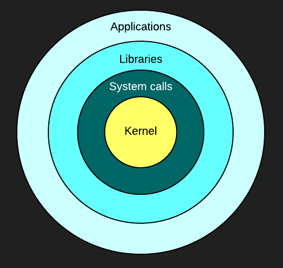

# Visualisation temps réel des appels systèmes Linux

## Chapitre 1 : Introduction

### 1.1 Description du projet en bref

Ce projet consiste à explorer des différents méthodes de visualisation de données reliées aux systèmes d'exploitation et de proposer une nouvelle option.

### 1.2 Contexte

Grand nombre d’entreprises ont des applications en production dont la performance de celles-ci est critique. Les requis de performance de ces applications sont tels qu’une tendance actuelle est de concevoir des architectures de nature distribuées, afin que l’application soit exécutée en parallèle sur plusieurs machines. Or, lorsque cette application ne performe pas à la hauteur des attentes ou qu’un problème survient en production, les administrateurs systèmes et développeurs doivent effectuer un diagnostic et localiser la source du problème.

### 1.3 Problématique

Diagnostiquer la source d’un problème de performance d’une application en production, qui est exécutée en parallèle sur différentes machines peut s’avérer une tâche ardue. D’autant plus si cette application fonctionne sur des systèmes d'exploitation (Operating system, ou OS) de type Linux, sur lesquels souvent le seul accès possible est via un simple terminal en mode texte.

Plusieurs outils en ligne commande existent pour examiner l’activité d’un système Linux, ou l’utilisation des différentes ressources de ce système, mais ceux-ci sont généralement très spécifique, c’est-à-dire qu’ils présentent l’activité en détail qu’une seule partie du système ( comme l’activité sur le réseau ) ou alors ils sont plutôt généraliste et ne présentent qu’un léger aperçu de l’activité des différentes parties du système.

### 1.4 Objectifs

L’objectif du projet est de proposer une alternative aux outils de diagnostic existants afin de faciliter l’analyse et la recherche de problèmes liés à la performance. Cette alternative devrait simplifier la tâche d’interpréter l’activité sur un ou plusieurs systèmes Linux, notamment dans le cas où l’application d’intérêt est de nature distribuée.

De plus, ce projet vise à explorer différentes techniques de visualisation de données afin de permettre à l’utilisateur d’explorer les résultats obtenus avec une interface graphique, une approche différente à la plupart des outils existants.

### 1.5 Résultats attendus

* Faciliter l’exploration et l’analyse des données

* Faciliter l’analyse de l’activité d’applications sur un ou plusieurs systèmes

* Diagnostic plus rapide des problèmes liés à la performance

* Gain de connaissances sur les applications et systèmes analysés

* Gain de productivité suite à l’amélioration de la performance

## Chapitre 2 : Analyse de la performance sous Linux

### 2.1 Revue de l'architecture de Linux

Pour obtenir des données sur l'activité d'une application précise il faut idéalement avoir en premier lieu une compréhension de l'environnement où est exécutée cette application, soit le système d'exploitation. Dans ce projet l'emphase est mise sur les sytèmes d'exploitations UNIX de type Linux, mais les principes de base restent les mêmes entre les différents OS.

De manière générale, un [système d'exploitation](http://fr.wikipedia.org/wiki/Syst%C3%A8me_d%27exploitation) sert d'interface entre l'accès au ressources d'une machine et les usagers et applications qui veulent utiliser ces ressources. Grâce à cette interface, les applications peuvent bénéficier de plusieurs services offerts par le système d'exploitation, tel l'ordonnancement, le système de fichier, la sécurité, etc.

Le matériel physique de la machine est donc géré par le système d'exploitation, ou plus précisément [le *Kernel*](http://fr.wikipedia.org/wiki/Noyau_de_syst%C3%A8me_d%27exploitation) ou noyau. En pratique, pour que cette abstraction entre la matériel et les applications soit respectée, le système d'exploitation est généralement divisé en deux sections, l'espace utilisateur et l'espace Kernel. 

Les applications des usagers sont alors exécutées dans l'espace utilisateur, où les permissions sont restreintes, et doivent demander la permissions au Kernel pour accéder aux ressources. Ces demandes sont nommées [appels systèmes](http://fr.wikipedia.org/wiki/Appel_syst%C3%A8me), ou *system calls* voire syscalls. Au débuts de UNIX il y avait approximativement 80 appels systèmes, aujourd'hui ce nombre s'élève à plus de 300. 

Parmi les appels systèmes les plus courants il y a [*read*](http://linux.die.net/man/2/read) et son équivalent [*write*](http://linux.die.net/man/2/write) qui permet de lire et d'écrire dans un *file descriptor*, typiquement un fichier sur le disque. La liste complète est diponible sur plusieurs sites tels que [kernelgrok.com](http://syscalls.kernelgrok.com/), et de l'information spécifique sur chaque appel système est disponible dans le manuel du OS (man), typiquement dans la section numéro 2. Ex : `man 2 read` 

Cette architecture divisées en espaces usager/kernel est souvent représentée de la manière suivante :

Tel qu'illustré sur la figure précédentes, les applications exécutées par les usagers d'une machine sont le dernier maillon de la chaine, et produisent le résultat attendu. Celles-ci ne peuvent toutefois fonctionner sans l'appui de tous les services implémentés par le système, services que l'application utilise par le biais de librairies ou d'appels systèmes directement. 

Le principal avantage d'une telle architecture est qu'elle permet d'éviter ou de limiter la duplication d'effort. En effet, les développeurs d'applications peuvent se fier aux services offerts par le sytème d'exploitation et n'ont pas besoin de ce soucier de problèmes liés à la gestion du matériel par example, et éviter d'y consacrer des efforts puisque ces problèmes sont déjà gérés par le OS. Tel que l'a souvent répété [David Wheeler](https://en.wikipedia.org/wiki/David_Wheeler_(British_computer_scientist)), un éminent chercheur en informatique :

> All problems in computer science can be solved by another level of indirection

Les couches d'abstrations, ou d'indirection, offertes par les OS suivent également cette idée.

Or puisque qu'en pratique les applications n'ont pas besoin de ce soucier de l'implémentation de ces couches sous-jacentes, pourquoi s'y intéresser lors de l'analyse de la performance de ces applications ? Cela dépend pricipalement du type d'analyse considéré. Lors de l'établisement d'indice de références, *benchmarks*, de la performance d'une application spécifique, le matériel et le système d'exploitation peuvent être ignorés - à la seule condition que les autres tests comparatifs soient réalisés sur le même exact environnement, pour qu'ils soient valides. 

Toutefois, lorsque l'objectif est d'améliorer la performance d'une application donnée, ou de résoudre un problème lié à la performance, tout doit être pris en considération. Les résultats obtenus vont varier considérablement selon l'environnement, qu'il s'agisse des différentes couches logicelles - de l'application elle-même jusqu'au Kernel, ou alors du matériel de la machine. De plus, lors de problèmes de performance, si la cause est due à du matériel ou des périphériques fautifs, alors c'est au niveau du OS qu'il faut regarder, car l'application elle-même ne connait pas l'état de la machine sur laquelle elle fonctionne.

### 2.2 Méthodologies de l'analyse de perfomance

Ce projet s'intéresse principalement aux analyses de performance reliées à l'amélioration ou la résolution de problèmes, et l'objectif final est de permettre à l'utilisateur d'en apprendre plus sur son application et la façon dont elle intéragit avec le OS pour améliorer celle-ci. L'établissement d'indices de performances, ou *benchmarks* ne sera pas considéré. Ceci dit, explorons les différentes techniques liées à ces types d'analyses. 

Dans son livre Systems Performance: Enterprise and the Cloud, Bredan Gregg propose différentes méthodologies pour procéder à la résolution de problèmes de performance. Celles-ci sont également détaillées sur son site web : [brendangregg.com/methodology.html](http://www.brendangregg.com/methodology.html). En voici quelques unes : 

> 6. Ad Hoc Checklist Method
> 7. Problem Statement Method
> 8. Scientific Method
> 9. Workload Characterization Method
> 10. Drill-Down Analysis Method
> 11. Five Whys Performance Method
> 12. By-Layer Method
> 13. Latency Analysis Method
> 14. Tools Method
> 15. USE Method  
> [...]

Deux méthodologies seront principalement utilisées dans le cadre du projet, soit la méthdode de caractérisation de la charge de travail *Workload Characterization Method*, et la méthode d'analyse par exploration *Drill-Down Analysis Method*. La caractérisation de la charge de travail consiste à identifier la source et la nature de la charge sur un système, et de suivre son évolution à travers le temps. Un changement soudain de la charge comparée à l'historique peut alors indiquer un problème potentiel, et l'identification du type de charge peut ensuite pointer vers la source. De manière générale, l'analyse par exploration, *Drill-Down*, consiste à examiner une vue d'ensemble d'un système, pour ensuite explorer plus en profondeur les détails d'un secteur d'intérêt en particulier. 

En effet, la solution proposée devrait permettre à un utilisateur de voir une vue d'ensemble du système analysé, et de permettre à cet utilisateur de sélectioner une partie du système qu'il l'intéresse, pour rafiner la vue affichée pour afficher les détails de cette partie. Une *vue* devrait idéalement permettre à l'usager de caractériser visuellement la charge de travail présente sur le système, et possiblement de comparer la charge actuelle à un historique.

### 2.3 Métriques et statistiques

Les métriques sont des statisques qui décrivent la performance de différentes parties du système. Généralement il s'agit d'un pourcentage d'utilisation, ou un nombre d'opérations par intervalle de temps (typiquement des secondes, ex : IOPS, I/O operations per second). 

* Métriques reliées au processeur et la mémoire :

Processor metrics                 Memory metrics
--------------------------        --------------------------
CPU utilization                   Free memory
User time                         Swap usage
System time                       Buffer and cache
Waiting time                      Slabs
Idle time                         Active vs inactive memory
Nice time
Load average
Runable processes
Blocked processes
Context switches
Interrupts
--------------------------        --------------------------

* Métriques reliées au réseau et aux disques :  

Network interface metrics       Block device metrics
--------------------------      --------------------------
Packets received and sent       IOwait
Bytes received and sent         Average queue length
Collisions per second           Average wait
Packets dropped                 Transfers per second 
Overruns
Errors
--------------------------      --------------------------
 

### 2.4 Données fournies par le Kernel

### 2.5 Revue des outils existants

### 2.6 Approches graphiques

## Chapitre 3 : Visualisation de données

### 3.1 Objectif

### 3.2 Théorie et bonnes pratiques

### 3.3 Revue des approches courantes

### 3.4 Description de l'approche choisie

### 3.5 Avantages et inconvéniants

### 3.6 Alternatives possibles

## Chapitre 4 : Conception du logiciel

### 4.1 Défis rencontrés

### 4.2 Architecture choisie

### 4.3 Diagrammes

## Chapitre 5 : Implémentation du logiciel

### 5.1 Outils utilisés

### 5.2 Méthodologie

### 5.3 Problèmes rencontrés

### 5.4 Solutions trouvées

### 5.5 Déploiement du logiciel

## Chapitre 6 : Discussion et conclusion

### 6.1 Dicussion

### 6.2 Recommandations

### 6.3 Conclusion

