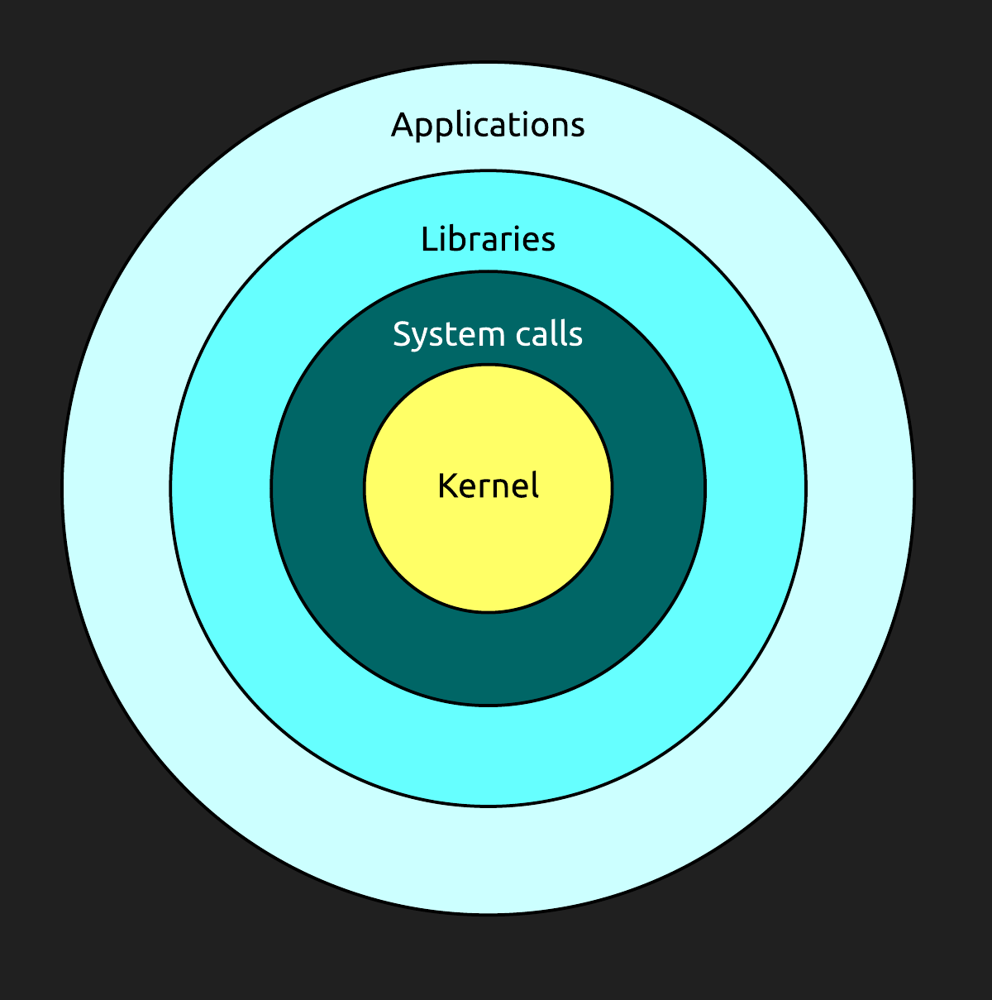
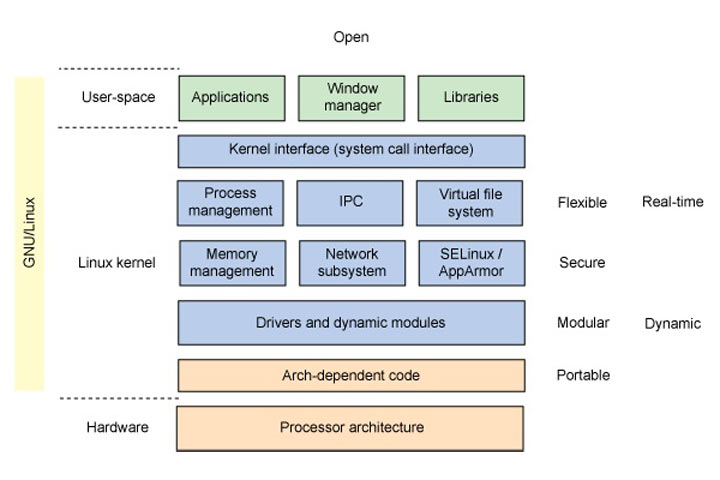

# Visualisation temps réel des appels systèmes Linux

## Chapitre 1 : Introduction

### 1.1 Description du projet en bref

### 1.2 Contexte

Grand nombre d’entreprises ont des applications en production dont la performance de celles-ci est critique. Les requis de performance de ces applications sont tels qu’une tendance actuelle est de concevoir des architectures de nature distribuées, afin que l’application soit exécutée simultanément sur plusieurs machines. Or lorsque cette application ne performe pas à la hauteur des attentes, ou qu’un problème survient en production, les administrateurs systèmes et développeurs doivent effectuer un diagnostic et localiser la source du problème.

### 1.3 Problématique

Diagnostiquer la source d’un problème de performance d’une application en production, qui est exécutée en parallèle sur différentes machines peut s’avérer une tâche ardue. D’autant plus si cette application fonctionne sur des systèmes de type UNIX, sur lesquels souvent le seul accès possible est via un simple terminal en mode texte.

Plusieurs outils en ligne commande existent pour examiner l’activité d’un système UNIX, ou l’utilisation des différentes ressources de ce système, mais ceux-ci sont généralement très spécifique, c’est-à-dire qu’ils présentent l’activité en détail qu’une seule partie du système ( comme l’activité sur le réseau ) ou alors ils sont plutôt généraliste et ne présentent qu’un léger aperçu de l’activité des différentes parties du système.

### 1.4 Objectifs

L’objectif du projet est de proposer une alternative aux outils de diagnostic existants afin de faciliter l’analyse et la recherche de problèmes liés à la performance. Cette alternative devrait simplifier la tâche d’interpréter l’activité sur un ou plusieurs systèmes UNIX, notamment dans le cas où l’application d’intérêt est de nature distribuée.

De plus, ce projet vise à explorer différentes techniques de visualisation de données afin de permettre à l’utilisateur d’explorer les résultats obtenus avec une interface graphique, une approche différente à la plupart des outils existants.

### 1.5 Résultats attendus

•	Faciliter l’exploration et l’analyse des données

•	Faciliter l’analyse de l’activité d’applications sur un ou plusieurs systèmes

•	Diagnostic plus rapide des problèmes liés à la performance

•	Gain de connaissances sur les applications et systèmes analysés

•	Gain de productivité suite à l’amélioration de la performance

## Chapitre 2 : Analyse de la performance sous Linux

### 2.1 Revue de l'architecture de Linux

### 2.2 Données et statistiques disponibles

### 2.3 Revue des outils existants

### 2.4 Approches graphiques

## Chapitre 3 : Visualisation de données

### 3.1 Objectif

### 3.2 Théorie et bonnes pratiques

### 3.3 Revue des approches courantes

### 3.4 Description de l'approche choisie

### 3.5 Avantages et inconvéniants

### 3.6 Alternatives possibles

## Chapitre 4 : Conception du logiciel

### 4.1 Défis rencontrés

### 4.2 Architecture choisie

### 4.3 Diagrammes

## Chapitre 5 : Implémentation du logiciel

### 5.1 Outils utilisés

### 5.2 Méthodologie

### 5.3 Problèmes rencontrés

### 5.4 Solutions trouvées

### 5.5 Déploiement du logiciel

## Chapitre 6 : Discussion et conclusion

### 6.1 Dicussion

### 6.2 Recommandations

### 6.3 Conclusion

