# Visualisation temps réel des appels systèmes Linux

## Chapitre 1 : Introduction

### 1.1 Description du projet en bref

Ce projet consiste à explorer des différents méthodes de visualisation de données reliées aux systèmes d'exploitation et de proposer une nouvelle option.

### 1.2 Contexte

Grand nombre d’entreprises ont des applications en production dont la performance de celles-ci est critique. Les requis de performance de ces applications sont tels qu’une tendance actuelle est de concevoir des architectures de nature distribuées, afin que l’application soit exécutée en parallèle sur plusieurs machines. Or, lorsque cette application ne performe pas à la hauteur des attentes ou qu’un problème survient en production, les administrateurs systèmes et développeurs doivent effectuer un diagnostic et localiser la source du problème.

### 1.3 Problématique

Diagnostiquer la source d’un problème de performance d’une application en production, qui est exécutée en parallèle sur différentes machines peut s’avérer une tâche ardue. D’autant plus si cette application fonctionne sur des systèmes d'exploitation (Operating system, ou OS) de type Linux, sur lesquels souvent le seul accès possible est via un simple terminal en mode texte.

Plusieurs outils en ligne commande existent pour examiner l’activité d’un système Linux, ou l’utilisation des différentes ressources de ce système, mais ceux-ci sont généralement très spécifique, c’est-à-dire qu’ils présentent l’activité en détail qu’une seule partie du système ( comme l’activité sur le réseau ) ou alors ils sont plutôt généraliste et ne présentent qu’un léger aperçu de l’activité des différentes parties du système.

### 1.4 Objectifs

L’objectif du projet est de proposer une alternative aux outils de diagnostic existants afin de faciliter l’analyse et la recherche de problèmes liés à la performance. Cette alternative devrait simplifier la tâche d’interpréter l’activité sur un ou plusieurs systèmes Linux, notamment dans le cas où l’application d’intérêt est de nature distribuée.

De plus, ce projet vise à explorer différentes techniques de visualisation de données afin de permettre à l’utilisateur d’explorer les résultats obtenus avec une interface graphique, une approche différente à la plupart des outils existants.

### 1.5 Résultats attendus

* Faciliter l’exploration et l’analyse des données

* Faciliter l’analyse de l’activité d’applications sur un ou plusieurs systèmes

* Diagnostic plus rapide des problèmes liés à la performance

* Gain de connaissances sur les applications et systèmes analysés

* Gain de productivité suite à l’amélioration de la performance

### 1.6 Terminologie

# TODO

Système d'exploitation : 

Linux : Nom couramment donné à tout système d'exploitation 
libre fonctionnant avec le noyau Linux. Implémentation libre du système UNIX qui respecte les spécifications POSIX.

Processus : 

Appel système : Un appel système (en anglais, system call, abrégé en syscall) est une fonction primitive fournie par le noyau d'un système d'exploitation et utilisée par les programmes s'exécutant dans l'espace utilisateur (en d'autres termes, tous les processus distincts du noyau).  

Temps réel : Un système temps réel est une application ou plus généralement un système pour lequel le respect des contraintes temporelles dans l'exécution des traitements est aussi important que le résultat de ces traitements. 

Visualisation de données : Domaine informatique multidisciplinaire don’t l’objet d’étude est la représentation visuelle de données. 

## Chapitre 2 : Analyse de la performance sous Linux

### 2.1 Revue de l'architecture de Linux

Pour obtenir des données sur l'activité d'une application précise il faut idéalement avoir en premier lieu une compréhension de l'environnement où est exécutée cette application, soit le système d'exploitation. Dans ce projet l'emphase est mise sur les sytèmes d'exploitations UNIX de type Linux, mais les principes de base restent les mêmes entre les différents OS.

De manière générale, un [système d'exploitation](http://fr.wikipedia.org/wiki/Syst%C3%A8me_d%27exploitation) sert d'interface entre l'accès au ressources d'une machine et les usagers et applications qui veulent utiliser ces ressources. Grâce à cette interface, les applications peuvent bénéficier de plusieurs services offerts par le système d'exploitation, tel l'ordonnancement, le système de fichier, la sécurité, etc.

Le matériel physique de la machine est donc géré par le système d'exploitation, ou plus précisément [le *Kernel*](http://fr.wikipedia.org/wiki/Noyau_de_syst%C3%A8me_d%27exploitation) ou noyau. En pratique, pour que cette abstraction entre la matériel et les applications soit respectée, le système d'exploitation est généralement divisé en deux sections, l'espace utilisateur et l'espace Kernel. 

Les applications des usagers sont alors exécutées dans l'espace utilisateur, où les permissions sont restreintes, et doivent demander la permissions au Kernel pour accéder aux ressources. Ces demandes sont nommées [appels systèmes](http://fr.wikipedia.org/wiki/Appel_syst%C3%A8me), ou *system calls* voire syscalls. Au débuts de UNIX il y avait approximativement 80 appels systèmes, aujourd'hui ce nombre s'élève à plus de 300. 

Parmi les appels systèmes les plus courants il y a [*read*](http://linux.die.net/man/2/read) et son équivalent [*write*](http://linux.die.net/man/2/write) qui permet de lire et d'écrire dans un *file descriptor*, typiquement un fichier sur le disque. La liste complète est diponible sur plusieurs sites tels que [kernelgrok.com](http://syscalls.kernelgrok.com/), et de l'information spécifique sur chaque appel système est disponible dans le manuel du OS (man), typiquement dans la section numéro 2. Ex : `man 2 read` 

Cette architecture divisées en espaces usager/kernel est souvent représentée de la manière suivante :

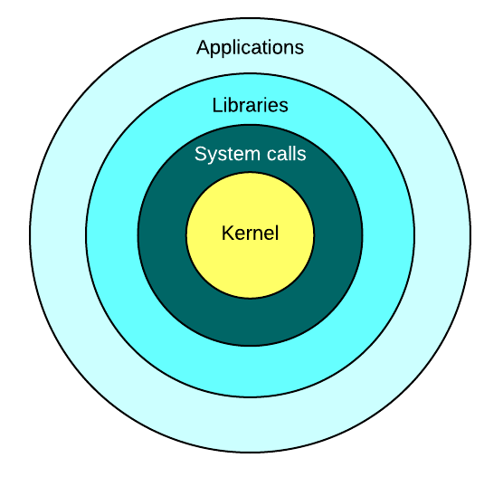

Tel qu'illustré sur la figure précédentes, les applications exécutées par les usagers d'une machine sont le dernier maillon de la chaine, et produisent le résultat attendu. Celles-ci ne peuvent toutefois fonctionner sans l'appui de tous les services implémentés par le système, services que l'application utilise par le biais de librairies ou d'appels systèmes directement. 

Le principal avantage d'une telle architecture est qu'elle permet d'éviter ou de limiter la duplication d'effort. En effet, les développeurs d'applications peuvent se fier aux services offerts par le sytème d'exploitation et n'ont pas besoin de ce soucier de problèmes liés à la gestion du matériel par example, et éviter d'y consacrer des efforts puisque ces problèmes sont déjà gérés par le OS. Tel que l'a souvent répété [David Wheeler](https://en.wikipedia.org/wiki/David_Wheeler_(British_computer_scientist)), un éminent chercheur en informatique :

> All problems in computer science can be solved by another level of indirection

Les couches d'abstrations, ou d'indirection, offertes par les OS suivent également cette idée.

Or puisque qu'en pratique les applications n'ont pas besoin de ce soucier de l'implémentation de ces couches sous-jacentes, pourquoi s'y intéresser lors de l'analyse de la performance de ces applications ? Cela dépend pricipalement du type d'analyse considéré. Lors de l'établisement d'indice de références, *benchmarks*, de la performance d'une application spécifique, le matériel et le système d'exploitation peuvent être ignorés - à la seule condition que les autres tests comparatifs soient réalisés sur le même exact environnement, pour qu'ils soient valides. 

Toutefois, lorsque l'objectif est d'améliorer la performance d'une application donnée, ou de résoudre un problème lié à la performance, tout doit être pris en considération. Les résultats obtenus vont varier considérablement selon l'environnement, qu'il s'agisse des différentes couches logicelles - de l'application elle-même jusqu'au Kernel, ou alors du matériel de la machine. De plus, lors de problèmes de performance, si la cause est due à du matériel ou des périphériques fautifs, alors c'est au niveau du OS qu'il faut regarder, car l'application elle-même ne connait pas l'état de la machine sur laquelle elle fonctionne.

### 2.2 Méthodologies de l'analyse de perfomance

Ce projet s'intéresse principalement aux analyses de performance reliées à l'amélioration ou la résolution de problèmes, et l'objectif final est de permettre à l'utilisateur d'en apprendre plus sur son application et la façon dont elle intéragit avec le OS pour améliorer celle-ci. L'établissement d'indices de performances, ou *benchmarks* ne sera pas considéré. Ceci dit, explorons les différentes techniques liées à ces types d'analyses. 

Dans son livre *Systems Performance: Enterprise and the Cloud*, Bredan Gregg propose différentes méthodologies pour procéder à la résolution de problèmes de performance. Celles-ci sont également détaillées sur son site web : [brendangregg.com/methodology.html](http://www.brendangregg.com/methodology.html). En voici quelques unes : 

> 6. Ad Hoc Checklist Method
> 7. Problem Statement Method
> 8. Scientific Method
> 9. Workload Characterization Method
> 10. Drill-Down Analysis Method
> 11. Five Whys Performance Method
> 12. By-Layer Method
> 13. Latency Analysis Method
> 14. Tools Method
> 15. USE Method  
> [...]

Deux méthodologies seront principalement utilisées dans le cadre du projet, soit la méthdode de caractérisation de la charge de travail *Workload Characterization Method*, et la méthode d'analyse par exploration *Drill-Down Analysis Method*. La caractérisation de la charge de travail consiste à identifier la source et la nature de la charge sur un système, et de suivre son évolution à travers le temps. Un changement soudain de la charge comparée à l'historique peut alors indiquer un problème potentiel, et l'identification du type de charge peut ensuite pointer vers la source. De manière générale, l'analyse par exploration, *Drill-Down*, consiste à examiner une vue d'ensemble d'un système, pour ensuite explorer plus en profondeur les détails d'un secteur d'intérêt en particulier. 

En effet, la solution proposée devrait permettre à un utilisateur de voir une vue d'ensemble du système analysé, et de permettre à cet utilisateur de sélectioner une partie du système qu'il l'intéresse, pour rafiner la vue affichée pour afficher les détails de cette partie. Une *vue* devrait idéalement permettre à l'usager de caractériser visuellement la charge de travail présente sur le système, et possiblement de comparer la charge actuelle à un historique.

### 2.3 Métriques et statistiques

Les métriques de performance sont des statisques qui mesurent l'activité de différentes parties du système. Généralement il s'agit d'un pourcentage d'utilisation, un nombre d'opérations par intervale de temps (typiquement des secondes, ex : IOPS, I/O operations per second), ou alors le temps de latence associé à une certaine opération. Le métriques peuvent être caculés directement par le système d'exploitation ou par des applications distinctes. 

Une très grande quantité de métriques peut être collectée à un temps donné sur un système d'exploitation, sans parler des métriques spécifique aux applications, cela peut résulter en une quantité considérable de données à analyser. Il est toutefois possible d'identifier quelques métriques clés qui peuvent donner une très bonne idée de l'état d'un système. À titre d'exemple, le *Redpaper* de IBM intitulé [*Linux Performance and Tuning Guidelines*](http://www.redbooks.ibm.com/redpapers/pdfs/redp4285.pdf) décrit pour Linux les métriques suivants (descriptions en annexe) :

Métriques du processeur                                     Métriques de la mémoire
--------------------------                                  --------------------------
[CPU utilization](#cpu-utilization)                         [Free memory](#free-memory)
[User time](#user-time)                                     [Swap usage](#swap-usage)
[System time](#system-time)                                 [Buffer and cache](#buffer-and-cache)
[Waiting time](#waiting-time)                               [Slabs](#slabs)
[Idle time](#idle-time)                                     [Active vs inactive memory](#active-vs-inactive-memory)
[Nice time](#nice-time)
[Load average](#load-average)
[Runable processes](#runnable-processes)
[Blocked processes](#blocked-processes)
[Context switches](#context-swiches)
[Interrupts](#interrups)
--------------------------                                  --------------------------

Métrique des cartes réseaux                                 Métriques des disques
----------------------------                                --------------------------
[Packets received and sent](#packets-received-and-sent)     [IOwait](#iowait)
[Bytes received and sent](#bytes-received-and-sent)         [Average queue length](#average-queue-length)
[Collisions per second](#collisions-per-second)             [Average wait](#average-wait)
[Packets dropped](#packets-dropped)                         [Transfers per second](#transferts-per-second)
[Overruns](#overruns)                                       [Blocks read/write per second](#blocks-readwrite-per-second)
[Errors](#errors)                                           [Kilobytes per second read/write](#kilobytes-per-second-readwrite)
----------------------------                                --------------------------

Les métriques sont surtout utile lorsqu'on peut les comparer à un historique, et alors constater soit une dégradation ou une amélioration de la performance. 

En pratique, collecter une grande quantité de métriques sur un système en production peut s'avérer utile lors de la résolution de problèmes, mais cela à un certain coût additionnel sur le système instrumenté, qui peut performer moins efficacement dépendament des cas. 

Une alternative pourrait être de collecter tous les métriques durant une certaine période, cibler ceux qui sont réelement d'intérêt et de se limiter à ceux-là en production. Rien n'empêche également d'activer l'instrumentation maximale suite à un changement dans le système tel un nouveau déploiement, et réduire par la suite l'instrumentation du système une fois sa stabilité établie. 

### 2.4 Données fournies par le Kernel

Les différents métriques énoncés plus haut peuvent être calculés par défaut par le Kernel (par l'incrémentation de compteurs), ou calculés par d'autre programmes externes. Différentes interfaces sont offertes par le Kernel pour accéder aux données et métriques du système, les deux principales sont les répertoires /proc et /sys. En effet puisque Linux prend à coeur la philosophie UNIX de *tout est un fichier*, ces données sont accessibles comme n'importe quel autre fichier ordinaire du système. /proc est toutefois créé dynamiquement par le Kernel au démarrage du système et n'existe qu'en mémoire vive, son contenu n'est enregistré sur aucun disque.

À titre d'exemple, le répertoire /proc est organisé de la façon suivante : /proc contient un répertoire pour chaque processus sur le système et ce répertoire est nommé selon le pid du processus. 

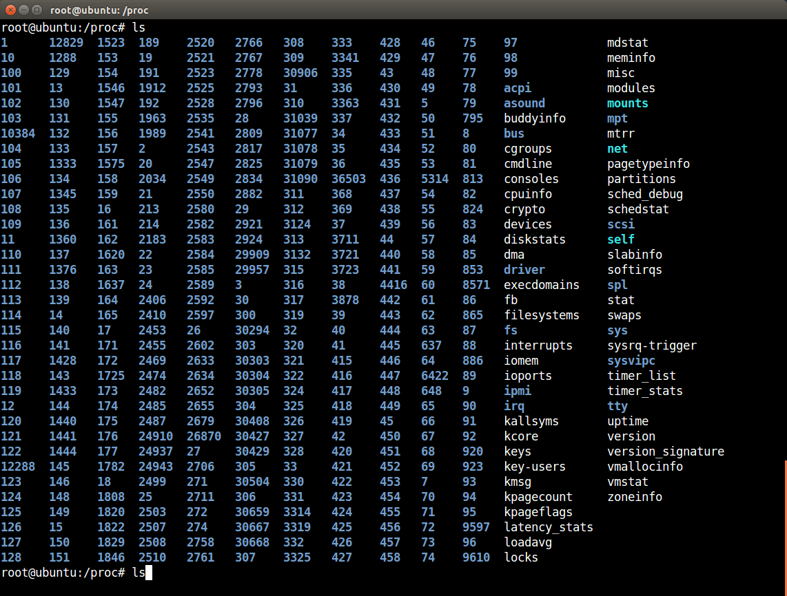

Ce répertoire contient ensuite quelques fichiers qui eux conservent les données reliées à ce processus, tels les arguments et statistiques.

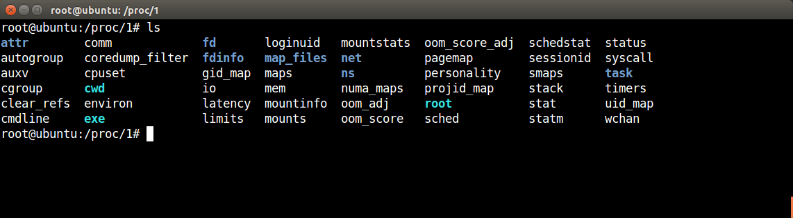

Quelques fichiers à la racine de /proc ne suivent pas cette nomenclature, il s'agit alors de propriétés de sous-systèmes du Kernel, ou de fichiers contenant les statistiques globales du système, tel loadavg qui contient un métrique générique de la charge du système pour les dernières minutes. 

Beaucoup d'outils d'analyse de la performance utilisent les répertoires /proc et /sys du Kernel comme source de données sur l'état global du système. Toutefois pour certains besoin spécifiques, tels la capture d'événements, d'autres interfaces sont offertes par le Kernel, telles les kprobes, ftrace, perf_event, etc.  Cela dépend de la nature de l'outil et du besoin qu'il cherche à combler, tel que détaillé par la section suivante.

### 2.5 Revue des outils existants

Un multitude d'outils existent pour identifier et diagnostiquer des problèmes de performance, ou pour simplement obtenir un aperçu de l'activité d'un système. Cette section vise à présenter un aperçu des différents outils disponibles sous Linux. 

#### 2.5.1 Processeur et mémoire

Commençons par les outils les plus génériques, installés par défaut sur tous les systèmes modernes. Ces outils permettent d'obtenir un aperçu de l'activité du système, au moment immédiat ou alors avec un historique, en présentant pour chaque processus son utilisation CPU et sa mémoire.

*ps*, pour process status est probablement le plus simple, il affiche simplement la liste des processus qui sont présent sur la machine et leurs paramètres, tel l'usager qui l'exécute, le process id, etc. ps affiche peu d'information reliées à la performance - à part l'utilisation CPU, mais c'est souvent le programme de choix pour voir rapidement ce qui fonctionne sur une machine.

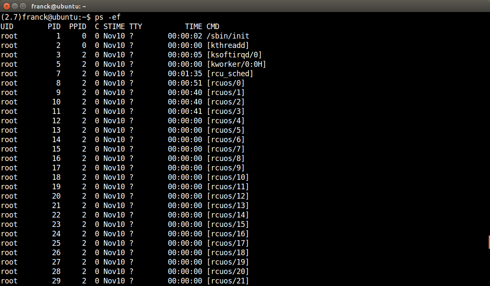

Le deuxième outil le plus répandu est sans aucun doute *top*. top permet de voir comme ps la liste des processus qui tournent, et affiche pour chaque processus l'utilisation CPU et mémoire en plus d'un indicateur global pour le système. Contrairement à ps top s'actualise à chaque seconde.

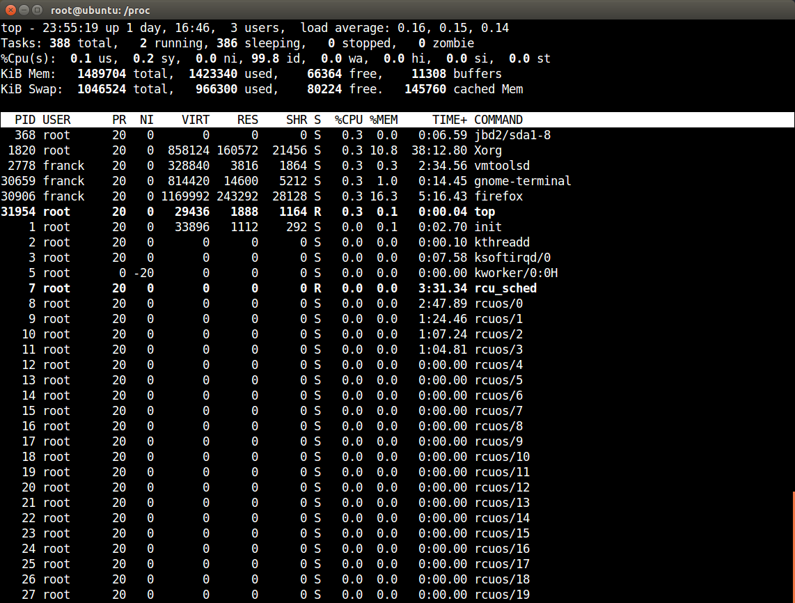

Plusieurs autres programmes se sont inspirés de top et visent à le remplacer en proposant une interface utilisateur plus moderne. Pour n'en citer que deux examples, *htop* tente de se démarquer par la couleur, et *vtop* lui propose un graphique sur lequel il est plus facile de voir l'évolution dans le temps.

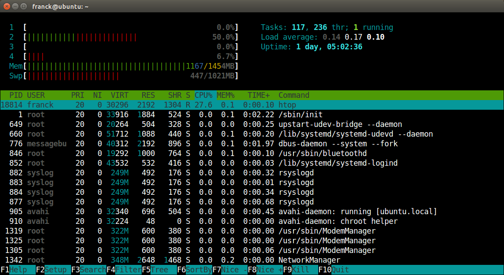

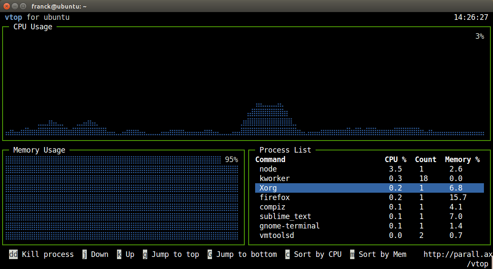

#### 2.5.2 Disques et réseau 

top et les autres outils précédents mettent davantage l'accent sur l'utilisation CPU et de la mémoire, or il existe plusieurs autres outils qui les complémentent en permettant de voir l'activité des autres ressources du système, tel les cartes réseaux et les disques.

*mpstat* et *vmstat* affichent des statistiques similaires à top, mais *iostat* quand à lui affiche des statistiques sur l'activité des disques durs du système.

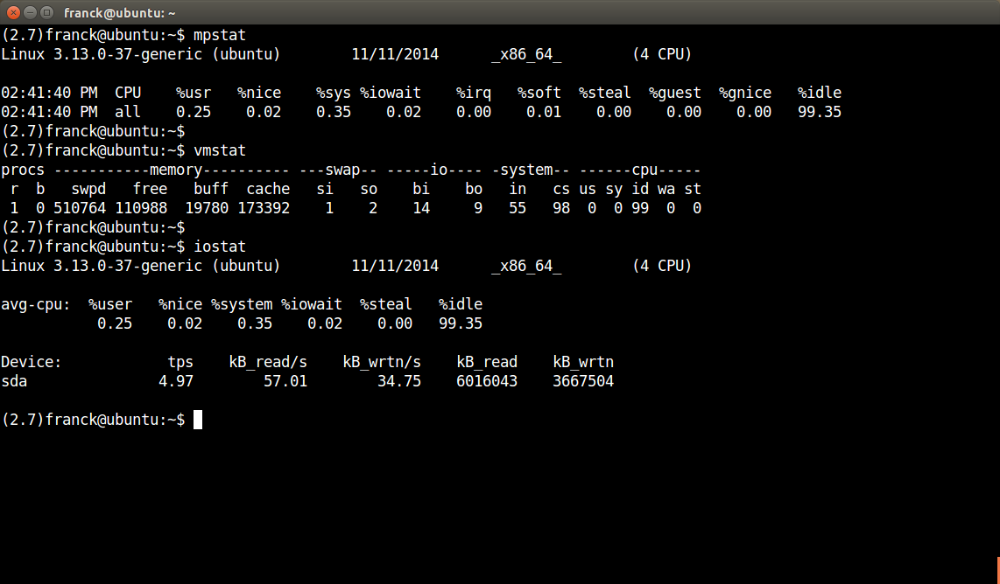

*netstat* quant à lui affiche les connexions réseau établies par les processus, très similaire à ps par le fait qu'il n'affiche que peu de statistiques sur les connexions mais c'est souvent la première étape pour déterminer l'état actuel.

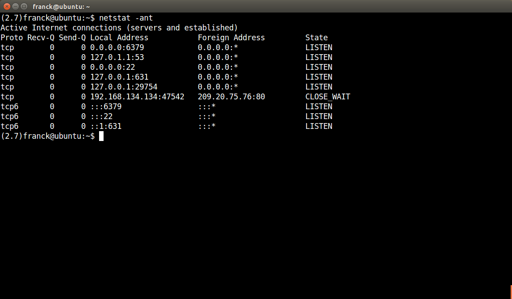

*nload* est un autre outil dédié à l'activité réseau, similaire à vtop du fait qu'il affiche un historique qui est mis à jour à un intervalle régulier.

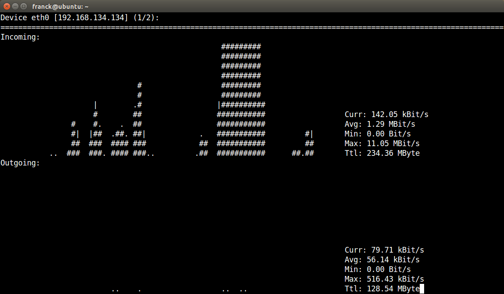

*iotop* est l'équivalent de top pour les disques durs. Il affiche l'activité de lecture et écriture sur les disques pour chaque processus et présente une liste des processus avec le plus d'activité.

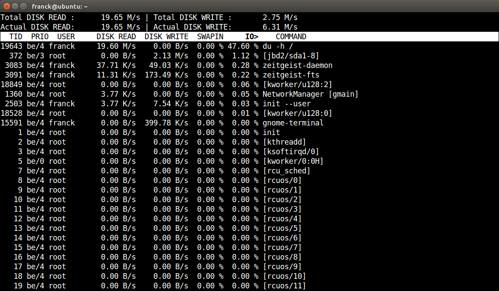

#### 2.5.3 Capture d'événements

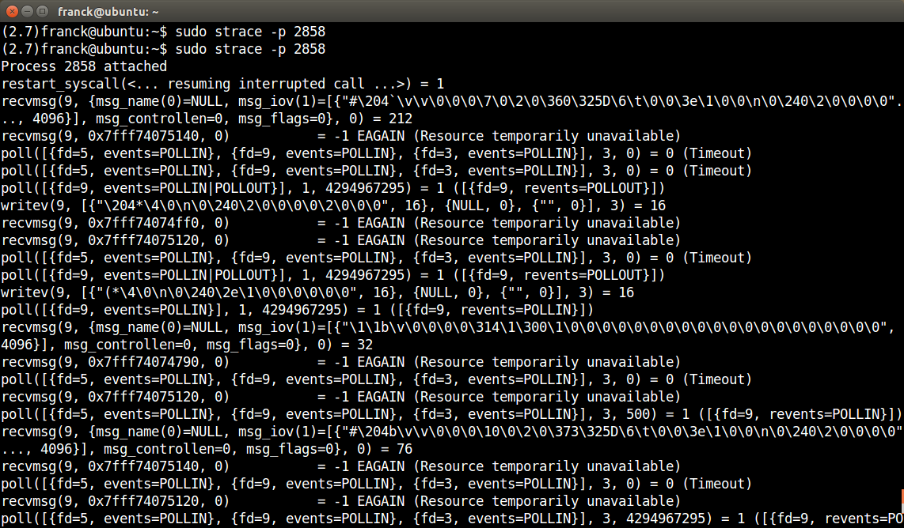

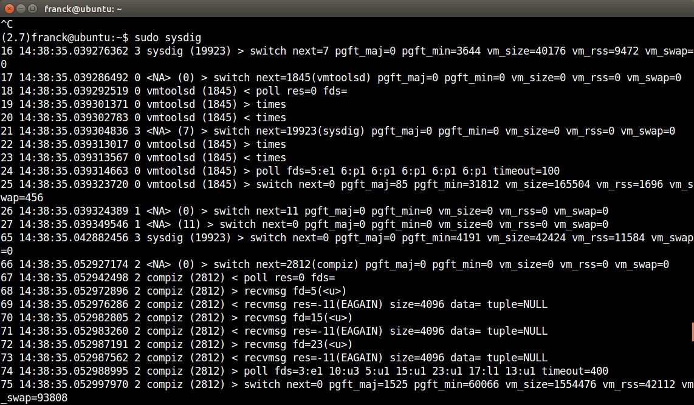

### 2.6 Approches graphiques

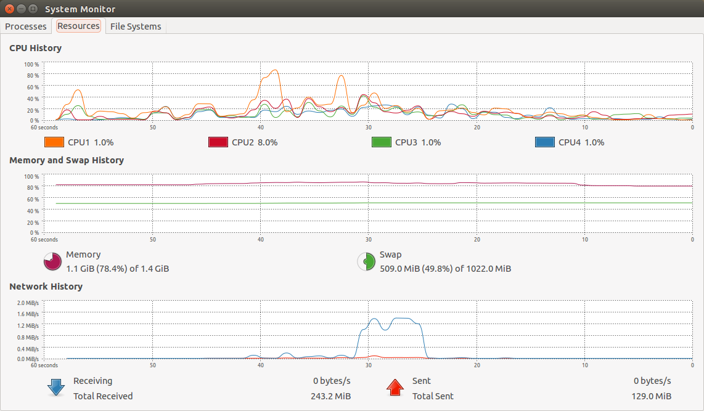

## Chapitre 3 : Visualisation de données

### 3.1 Objectif

### 3.2 Théorie et bonnes pratiques

### 3.3 Revue des approches courantes

### 3.4 Description de l'approche choisie

### 3.5 Avantages et inconvéniants

### 3.6 Alternatives possibles

## Chapitre 4 : Conception du logiciel

### 4.1 Défis rencontrés

### 4.2 Architecture choisie

### 4.3 Diagrammes

## Chapitre 5 : Implémentation du logiciel

### 5.1 Outils utilisés

### 5.2 Méthodologie

### 5.3 Problèmes rencontrés

### 5.4 Solutions trouvées

### 5.5 Déploiement du logiciel

## Chapitre 6 : Discussion et conclusion

### 6.1 Dicussion

### 6.2 Recommandations

### 6.3 Conclusion

## Annexe

### Description des métriques

Tirées de http://www.redbooks.ibm.com/redpapers/pdfs/redp4285.pdf

#### CPU utilization

This is probably the most straightforward metric. It describes the overall utilization per processor. On IBM System x architectures, if the CPU utilization exceeds 80% for a sustained period of time, a processor bottleneck is likely.

#### User time

Depicts the CPU percentage spent on user processes, including nice time. High values in user time are generally desirable because, in this case, the system performs actual work. 

#### System time

Depicts the CPU percentage spent on kernel operations including IRQ and softirq time. High and sustained system time values can point you to bottlenecks in the network and driver stack. A system should generally spend as little time as possible in kernel time.

#### Waiting time

Total amount of CPU time spent waiting for an I/O operation to occur. Like the blocked value, a system should not spend too much time waiting for I/O operations; otherwise you should investigate the performance of the respective I/O subsystem.

#### Idle time

Depicts the CPU percentage the system was idle waiting for tasks.

#### Nice time

Depicts the CPU percentage spent on re-nicing processes that change the execution order and priority of processes.

#### Load average

The load average is not a percentage, but the rolling average of the sum of the following:

– The number of processes in queue waiting to be processed  

– The number of processes waiting for uninterruptable task to be completed

That is, the average of the sum of TASK_RUNNING and TASK_UNINTERRUPTIBLE processes. If processes that request CPU time are blocked (which means that the CPU has no time to process them), the load average will increase. On the other hand, if each process gets immediate access to CPU time and there are no CPU cycles lost, the load will decrease.

#### Runable processes

This value depicts the processes that are ready to be executed. This value should not exceed 10 times the amount of physical processors for a sustained period of time; otherwise a processor bottleneck is likely.

#### Blocked processes

Processes that cannot execute while they are waiting for an I/O operation to finish. Blocked processes can point you toward an I/O bottleneck.

#### Context switches

Amount of switches between threads that occur on the system. High numbers of context switches in connection with a large number of interrupts can signal driver or application issues. Context switches generally are not desirable because the CPU cache is flushed with each one, but some context switching is necessary. Refer to 1.1.5, “Context switching” on page 5.

#### Interrupts

The interrupt value contains hard interrupts and soft interrupts. Hard interrupts have a more adverse effect on system performance. High interrupt values are an indication of a software bottleneck, either in the kernel or a driver. Remember that the interrupt value includes the interrupts caused by the CPU clock. Refer to 1.1.6, “Interrupt handling” on page 6.

#### Free memory

Compared to most other operating systems, the free memory value in Linux should not be a cause for concern. As explained in 1.2.2, “Virtual memory manager” on page 12, the Linux kernel allocates most unused memory as file system cache, so subtract the amount of buffers and cache from the used memory to determine (effectively) free memory.

#### Swap usage

This value depicts the amount of swap space used. As described in 1.2.2, “Virtual memory manager” on page 12, swap usage only tells you that Linux manages memory really efficiently. Swap In/Out is a reliable means of identifying a memory bottleneck. Values above 200 to 300 pages per second for a sustained period of time express a likely memory bottleneck.

#### Buffer and cache

Cache allocated as file system and block device cache.

#### Slabs

Depicts the kernel usage of memory. Note that kernel pages cannot be paged out to disk.

#### Active vs inactive memory

Provides you with information about the active use of the system memory. Inactive memory is a likely candidate to be swapped out to disk by the kswapd daemon. Refer to “Page frame reclaiming” on page 14.

#### Packets received and sent

This metric informs you of the quantity of packets received and sent by a given network interface.

#### Bytes received and sent

This value depicts the number of bytes received and sent by a given network interface.

#### Collisions per second

This value provides an indication of the number of collisions that occur on the network that the respective interface is connected to. Sustained values of collisions often concern a bottleneck in the network infrastructure, not the server. On most properly configured networks, collisions are very rare unless the network infrastructure consists of hubs.

#### Packets dropped

This is a count of packets that have been dropped by the kernel, either due to a firewall configuration or due to a lack of network buffers.

#### Overruns

Overruns represent the number of times that the network interface ran out of buffer space. This metric should be used in conjunction with the packets dropped value to identify a possible bottleneck in network buffers or the network queue length.

#### Errors

The number of frames marked as faulty. This is often caused by a network mismatch or a partially broken network cable. Partially broken network cables can be a significant performance issue for copper-based gigabit networks.

#### IOwait

Time the CPU spends waiting for an I/O operation to occur. High and sustained values most likely indicate an I/O bottleneck.

#### Average queue length

Amount of outstanding I/O requests. In general, a disk queue of 2 to 3 is optimal; higher values might point toward a disk I/O bottleneck.

#### Average wait

A measurement of the average time in ms it takes for an I/O request to be serviced. The wait time consists of the actual I/O operation and the time it waited in the I/O queue.

#### Transfers per second

Depicts how many I/O operations per second are performed (reads and writes). The transfers per second metric in conjunction with the kBytes per second value helps you to identify the average transfer size of the system. The average transfer size generally should match with the stripe size used by your disk subsystem.

#### Blocks read/write per second

This metric depicts the reads and writes per second expressed in blocks of 1024 bytes as of kernel 2.6. Earlier kernels may report different block sizes, from 512 bytes to 4 KB.
 
#### Kilobytes per second read/write

Reads and writes from/to the block device in kilobytes represent the amount of actual data transferred to and from the block device.

