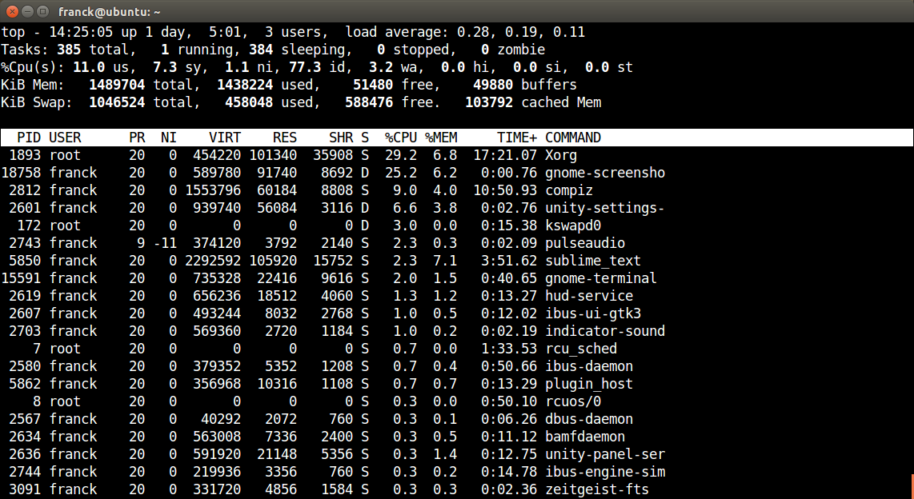

<!-- Rapport final de PFE - Francis Bonneau, automne 2014 -->

# Visualisation temps réel des appels systèmes Linux

## Chapitre 1 : Introduction

### 1.1 Description du projet en bref

Ce projet consiste à explorer des différents méthodes de visualisation de données reliées aux systèmes d'exploitation et de proposer une nouvelle option.

### 1.2 Contexte

Grand nombre d’entreprises ont des applications en production dont la performance de celles-ci est critique. Les requis de performance de ces applications sont tels qu’une tendance actuelle est de concevoir des architectures de nature distribuées, afin que l’application soit exécutée en parallèle sur plusieurs machines. Or, lorsque cette application ne performe pas à la hauteur des attentes ou qu’un problème survient en production, les administrateurs systèmes et développeurs doivent effectuer un diagnostic et localiser la source du problème.

### 1.3 Problématique

Diagnostiquer la source d’un problème de performance d’une application en production, qui est exécutée en parallèle sur différentes machines peut s’avérer une tâche ardue. D’autant plus si cette application fonctionne sur des systèmes d'exploitation (Operating system, ou OS) de type Linux, sur lesquels souvent le seul accès possible est via un simple terminal en mode texte.

Plusieurs outils en ligne commande existent pour examiner l’activité d’un système Linux, ou l’utilisation des différentes ressources de ce système, mais ceux-ci sont généralement très spécifique, c’est-à-dire qu’ils présentent l’activité en détail qu’une seule partie du système ( comme l’activité sur le réseau ) ou alors ils sont plutôt généraliste et ne présentent qu’un léger aperçu de l’activité des différentes parties du système.

### 1.4 Objectifs

L’objectif du projet est de proposer une alternative aux outils de diagnostic existants afin de faciliter l’analyse et la recherche de problèmes liés à la performance. Cette alternative devrait simplifier la tâche d’interpréter l’activité sur un ou plusieurs systèmes Linux, notamment dans le cas où l’application d’intérêt est de nature distribuée.

De plus, ce projet vise à explorer différentes techniques de visualisation de données afin de permettre à l’utilisateur d’explorer les résultats obtenus avec une interface graphique, une approche différente à la plupart des outils existants.

### 1.5 Résultats attendus

* Faciliter l’exploration et l’analyse des données

* Faciliter l’analyse de l’activité d’applications sur un ou plusieurs systèmes

* Diagnostic plus rapide des problèmes liés à la performance

* Gain de connaissances sur les applications et systèmes analysés

* Gain de productivité suite à l’amélioration de la performance

### 1.6 Terminologie

Système d'exploitation : 

Linux : Nom couramment donné à tout système d'exploitation libre fonctionnant avec le noyau Linux. Implémentation libre du système UNIX qui respecte les spécifications POSIX.^[Ref 01]

Processus : 

Daemon : 

Appel système : Un appel système (en anglais, system call, abrégé en syscall) est une fonction primitive fournie par le noyau d'un système d'exploitation et utilisée par les programmes s'exécutant dans l'espace utilisateur (en d'autres termes, tous les processus distincts du noyau).^[Ref 02]

Temps réel : Un système temps réel est une application ou plus généralement un système pour lequel le respect des contraintes temporelles dans l'exécution des traitements est aussi important que le résultat de ces traitements.^[Ref 03] ^[Ref 04]

Visualisation de données : Domaine informatique multidisciplinaire don’t l’objet d’étude est la représentation visuelle de données.^[Ref 05]

## Chapitre 2 : Analyse de la performance sous Linux

### 2.1 Revue de l'architecture de Linux

Pour obtenir des données sur l'activité d'une application précise il faut idéalement avoir en premier lieu une compréhension de l'environnement où est exécutée cette application, soit le système d'exploitation. Dans ce projet l'emphase est mise sur les sytèmes d'exploitations UNIX de type Linux, mais les principes de base restent les mêmes entre les différents OS.

De manière générale, un [système d'exploitation](http://fr.wikipedia.org/wiki/Syst%C3%A8me_d%27exploitation) sert d'interface entre l'accès au ressources d'une machine et les usagers et applications qui veulent utiliser ces ressources. Grâce à cette interface, les applications peuvent bénéficier de plusieurs services offerts par le système d'exploitation, tel l'ordonnancement, le système de fichier, la sécurité, etc.

Le matériel physique de la machine est donc géré par le système d'exploitation, ou plus précisément [le *Kernel*](http://fr.wikipedia.org/wiki/Noyau_de_syst%C3%A8me_d%27exploitation) ou noyau. En pratique, pour que cette abstraction entre la matériel et les applications soit respectée, le système d'exploitation est généralement divisé en deux sections, l'espace utilisateur et l'espace Kernel. 

Les applications des usagers sont alors exécutées dans l'espace utilisateur, où les permissions sont restreintes, et doivent demander la permissions au Kernel pour accéder aux ressources. Ces demandes sont nommées [appels systèmes](http://fr.wikipedia.org/wiki/Appel_syst%C3%A8me), ou *system calls* voire syscalls. Au débuts de UNIX il y avait approximativement 80 appels systèmes, aujourd'hui ce nombre s'élève à plus de 300. 

Parmi les appels systèmes les plus courants il y a [*read*](http://linux.die.net/man/2/read) et son équivalent [*write*](http://linux.die.net/man/2/write) qui permet de lire et d'écrire dans un *file descriptor*, typiquement un fichier sur le disque. La liste complète est diponible sur plusieurs sites tels que [kernelgrok.com](http://syscalls.kernelgrok.com/), et de l'information spécifique sur chaque appel système est disponible dans le manuel du OS (man), typiquement dans la section numéro 2 (`man 2 read`).

Cette architecture divisées en espaces usager/kernel est souvent représentée de la manière suivante :

Tel qu'illustré sur la figure précédentes, les applications exécutées par les usagers d'une machine sont le dernier maillon de la chaine, et produisent le résultat attendu. Celles-ci ne peuvent toutefois fonctionner sans l'appui de tous les services implémentés par le système, services que l'application utilise par le biais de librairies ou d'appels systèmes directement. 

Le principal avantage d'une telle architecture est qu'elle permet d'éviter ou de limiter la duplication d'effort. En effet, les développeurs d'applications peuvent se fier aux services offerts par le sytème d'exploitation et n'ont pas besoin de ce soucier de problèmes liés à la gestion du matériel par example, et éviter d'y consacrer des efforts puisque ces problèmes sont déjà gérés par le OS. Tel que l'a souvent répété [David Wheeler](https://en.wikipedia.org/wiki/David_Wheeler_(British_computer_scientist)), un éminent chercheur en informatique :

> All problems in computer science can be solved by another level of indirection  
­*-- David Wheeler*^[Ref 19]

Les couches d'abstrations offertes par les OS suivent également cette idée.

Or puisque qu'en pratique les applications n'ont pas besoin de ce soucier de l'implémentation de ces couches sous-jacentes, pourquoi s'y intéresser lors de l'analyse de la performance de ces applications ? Cela dépend pricipalement du type d'analyse considéré. Lors de l'établisement d'indice de références, *benchmarks*, de la performance d'une application spécifique, le matériel et le système d'exploitation peuvent être ignorés - à la seule condition que les autres tests comparatifs soient réalisés sur le même exact environnement, pour qu'ils soient valides. 

Toutefois, lorsque l'objectif est d'améliorer la performance d'une application donnée, ou de résoudre un problème lié à la performance, tout doit être pris en considération. Les résultats obtenus vont varier considérablement selon l'environnement, qu'il s'agisse des différentes couches logicelles - de l'application elle-même jusqu'au Kernel, ou alors du matériel de la machine. De plus, lors de problèmes de performance, si la cause est due à du matériel ou des périphériques fautifs, alors c'est au niveau du OS qu'il faut regarder, car l'application elle-même ne connait pas l'état de la machine sur laquelle elle fonctionne.

### 2.2 Méthodologies de l'analyse de perfomance

Ce projet s'intéresse principalement aux analyses de performance reliées à l'amélioration ou la résolution de problèmes, et l'objectif final est de permettre à l'utilisateur d'en apprendre plus sur son application et la façon dont elle intéragit avec le OS pour améliorer celle-ci. L'établissement d'indices de performances, ou *benchmarks* ne sera pas considéré. Ceci dit, explorons les différentes techniques liées à ces types d'analyses. 

Dans son livre *Systems Performance: Enterprise and the Cloud*^[Ref 13], Bredan Gregg propose différentes méthodologies pour procéder à la résolution de problèmes de performance. Celles-ci sont également détaillées sur son site web : [brendangregg.com/methodology.html](http://www.brendangregg.com/methodology.html). En voici quelques unes : 

> 6. Ad Hoc Checklist Method
> 7. Problem Statement Method
> 8. Scientific Method
> 9. Workload Characterization Method
> 10. Drill-Down Analysis Method
> 11. Five Whys Performance Method
> 12. By-Layer Method
> 13. Latency Analysis Method
> 14. Tools Method
> 15. USE Method  
> [...]

Deux méthodologies seront principalement utilisées dans le cadre du projet, soit la méthdode de caractérisation de la charge de travail *Workload Characterization Method*, et la méthode d'analyse par exploration *Drill-Down Analysis Method*. La caractérisation de la charge de travail consiste à identifier la source et la nature de la charge sur un système, et de suivre son évolution à travers le temps. Un changement soudain de la charge comparée à l'historique peut alors indiquer un problème potentiel, et l'identification du type de charge peut ensuite pointer vers la source. De manière générale, l'analyse par exploration, *Drill-Down*, consiste à examiner une vue d'ensemble d'un système, pour ensuite explorer plus en profondeur les détails d'un secteur d'intérêt en particulier. 

En effet, la solution proposée devrait permettre à un utilisateur de voir une vue d'ensemble du système analysé, et de permettre à cet utilisateur de sélectioner une partie du système qu'il l'intéresse, pour rafiner la vue affichée pour afficher les détails de cette partie. Une *vue* devrait idéalement permettre à l'usager de caractériser visuellement la charge de travail présente sur le système, et possiblement de comparer la charge actuelle à un historique.

### 2.3 Métriques et statistiques

Les métriques de performance sont des statisques qui mesurent l'activité de différentes parties du système. Généralement il s'agit d'un pourcentage d'utilisation, un nombre d'opérations par intervale de temps (typiquement des secondes, ex : IOPS, I/O operations per second), ou alors le temps de latence associé à une certaine opération. Le métriques peuvent être caculés directement par le système d'exploitation ou par des applications distinctes. 

Une très grande quantité de métriques peut être collectée à un temps donné sur un système d'exploitation, sans parler des métriques spécifique aux applications, cela peut résulter en une quantité considérable de données à analyser. Il est toutefois possible d'identifier quelques métriques clés qui peuvent donner une très bonne idée de l'état d'un système. À titre d'exemple, le *Redpaper* de IBM intitulé [*Linux Performance and Tuning Guidelines*](http://www.redbooks.ibm.com/redpapers/pdfs/redp4285.pdf) décrit pour Linux les métriques suivants^[Ref 10] (descriptions en annexe) :

Métriques du processeur                                     Métriques de la mémoire
--------------------------                                  --------------------------
[CPU utilization](#cpu-utilization)                         [Free memory](#free-memory)
[User time](#user-time)                                     [Swap usage](#swap-usage)
[System time](#system-time)                                 [Buffer and cache](#buffer-and-cache)
[Waiting time](#waiting-time)                               [Slabs](#slabs)
[Idle time](#idle-time)                                     [Active vs inactive memory](#active-vs-inactive-memory)
[Nice time](#nice-time)
[Load average](#load-average)
[Runable processes](#runnable-processes)
[Blocked processes](#blocked-processes)
[Context switches](#context-swiches)
[Interrupts](#interrups)
--------------------------                                  --------------------------

Métrique des cartes réseaux                                 Métriques des disques
----------------------------                                --------------------------
[Packets received and sent](#packets-received-and-sent)     [IOwait](#iowait)
[Bytes received and sent](#bytes-received-and-sent)         [Average queue length](#average-queue-length)
[Collisions per second](#collisions-per-second)             [Average wait](#average-wait)
[Packets dropped](#packets-dropped)                         [Transfers per second](#transferts-per-second)
[Overruns](#overruns)                                       [Blocks read/write per second](#blocks-readwrite-per-second)
[Errors](#errors)                                           [Kilobytes per second read/write](#kilobytes-per-second-readwrite)
----------------------------                                --------------------------

Les métriques sont surtout utile lorsqu'on peut les comparer à un historique, et alors constater soit une dégradation ou une amélioration de la performance. 

En pratique, collecter une grande quantité de métriques sur un système en production peut s'avérer utile lors de la résolution de problèmes, mais cela à un certain coût additionnel sur le système instrumenté, qui peut performer moins efficacement dépendament des cas. 

Une alternative pourrait être de collecter tous les métriques durant une certaine période, cibler ceux qui sont réelement d'intérêt et de se limiter à ceux-là en production. Rien n'empêche également d'activer l'instrumentation maximale suite à un changement dans le système tel un nouveau déploiement, et réduire par la suite l'instrumentation du système une fois sa stabilité établie. 

### 2.4 Données fournies par le Kernel

Les différents métriques énoncés plus haut peuvent être calculés par défaut par le Kernel (par l'incrémentation de compteurs), ou calculés par d'autre programmes externes. Différentes interfaces sont offertes par le Kernel pour accéder aux données et métriques du système, les deux principales sont les répertoires /proc et /sys. En effet puisque Linux prend à coeur la philosophie UNIX de *tout est un fichier*, ces données sont accessibles comme n'importe quel autre fichier ordinaire du système. /proc est toutefois créé dynamiquement par le Kernel au démarrage du système et n'existe qu'en mémoire vive, son contenu n'est enregistré sur aucun disque.

À titre d'exemple, le répertoire /proc est organisé de la façon suivante : /proc contient un répertoire pour chaque processus sur le système et ce répertoire est nommé selon le pid du processus. 

Ce répertoire contient ensuite quelques fichiers qui eux conservent les données reliées à ce processus, tels les arguments et statistiques.

Quelques fichiers à la racine de /proc ne suivent pas cette nomenclature, il s'agit alors de propriétés de sous-systèmes du Kernel, ou de fichiers contenant les statistiques globales du système, tel loadavg qui contient un métrique générique de la charge du système pour les dernières minutes. 

Beaucoup d'outils d'analyse de la performance utilisent les répertoires /proc et /sys du Kernel comme source de données sur l'état global du système. Toutefois pour certains besoin spécifiques, tels la capture d'événements, d'autres interfaces sont offertes par le Kernel, telles les kprobes, ftrace, perf_event, etc.  Cela dépend de la nature de l'outil et du besoin qu'il cherche à combler, tel que détaillé par la section suivante.

### 2.5 Revue des outils existants

Un multitude d'outils existent pour identifier et diagnostiquer des problèmes de performance, ou pour simplement obtenir un aperçu de l'activité d'un système. Cette section vise à présenter un aperçu des différents outils disponibles sous Linux. 

#### 2.5.1 Processeur et mémoire

Commençons par les outils les plus génériques, installés par défaut sur tous les systèmes modernes. Ces outils permettent d'obtenir un aperçu de l'activité du système, au moment immédiat ou alors avec un historique, en présentant pour chaque processus son utilisation CPU et sa mémoire.

*ps*, pour process status est probablement le plus simple, il affiche simplement la liste des processus qui sont présent sur la machine et leurs paramètres, tel l'usager qui l'exécute, le process id, etc. ps affiche peu d'information reliées à la performance - à part l'utilisation CPU, mais c'est souvent le programme de choix pour voir rapidement ce qui fonctionne sur une machine.

Il y a plusieurs autres façons de représenter cette liste de processus, une représentation en arbre comme l'offre *pstree* est également commune. htop, décrit plus loin offre également cet affichage.

L'autre outil le plus répandu est sans aucun doute *top*. top permet de voir comme ps la liste des processus qui tournent, et affiche pour chaque processus l'utilisation CPU et mémoire en plus d'un indicateur global pour le système. Contrairement à ps, top s'actualise à chaque seconde.

Plusieurs autres programmes se sont inspirés de top et visent à le remplacer en proposant une interface utilisateur plus moderne. Pour n'en citer que deux examples, *[htop](http://hisham.hm/htop/)* tente de se démarquer par la couleur, et *[vtop](https://parall.ax/vtop)* lui propose un graphique sur lequel il est plus facile de voir l'évolution dans le temps.

Bien que la plupart des outils sont exécutés directement par l'usager, d'autre outils tels que *sar* fontionne en permanence en tant que daemon sur le système et visent plutôt à conserver un historique long terme de l'activité du système. Pour mettre en place le service sur certains systèmes des packages supplémentaires doivent être installés, tel que sysstat sur ubuntu, mais une fois le service établi il est possible d'accéder l'historique avec sar :

#### 2.5.2 Disques et réseau 

top et les autres outils précédents mettent davantage l'accent sur l'utilisation CPU et de la mémoire, or il existe plusieurs autres outils qui les complémentent en permettant de voir l'activité des autres ressources du système, tel les cartes réseaux et les disques.

Plusieurs outils de la famille \*stat peuvent être utilisés à cet effet. *mpstat* et *vmstat* affichent des statistiques similaires à top, mais *iostat* quand à lui affiche des statistiques sur l'activité des disques durs du système.

*netstat* quant à lui affiche les connexions réseau établies par les processus, très similaire à ps par le fait qu'il n'affiche que peu de statistiques sur les connexions mais c'est souvent la première étape pour déterminer l'état actuel.

*[nload](http://www.roland-riegel.de/nload/)* est un autre outil dédié à l'activité réseau, similaire à vtop du fait qu'il affiche un historique qui est mis à jour à un intervalle régulier.

*[iotop](http://guichaz.free.fr/iotop/)* est l'équivalent de top pour les disques durs. Il affiche l'activité de lecture et écriture sur les disques pour chaque processus et présente une liste des processus avec le plus d'activité.

Un autre logiciel qui mérite d'être mentionné est *[Collectl](http://collectl.sourceforge.net/index.html)*, qui est similaire aux autres outils *stat du fait qu'il affiche les données à un intervalle régulier, mais il se démarque par la quantité de données qu'il peut accéder, Collectl permet de mesurer l'activité d'une quantité impressionnante de sous-sytèmes différents, que ce soit la mémoire, les disques, le réseau, et même certaines cartes graphiques. 

#### 2.5.3 Capture d'événements

Les outils présentés jusqu'à présent permettent de mesurer l'activité de différentes parties d'un système donné, et d'indentifier avec différents niveaux de succès la source de cette activité, dumoins le processus responsable. Or, lorsqu'un problème survient sur un processus critique du système, et qu'il faut identifier ce que fait ce processus et la source du problème, il faut parfois plus de données. Une façon d'obtenir ces données est par l'utilisation de logiciel de traçage ou *tracing*, qui eux peuvent capturer les évements en temps réel et afficher ceux-ci.

La définition d'un événement peut varier selon l'outil, mais typiquement il s'agit d'une intéraction entre un processus et le système d'exploitation à un instant précis. Cette intéraction prend souvent la forme d'un appel système, et dans ce cas il s'agit alors d'une requête par le procesus suivie d'une réponse par le système quelques instants après. Par example un processus peut envoyer une requête de lecture *read* pour accéder aux derniers octets du fichier /var/log/syslog, et le système va répondre en envoyant les quelques octets demandés peu de temps après.

Juste le fait de pouvoir observer en temps réel les différentes requêtes d'accès au système de fichiers ou au réseau permet d'en apprendre beaucoup sur l'état du processus et d'analyser son comportement pour voir si il réagit comme il le devrait. *strace* est un outil disponible par défaut sur presque tous les systèmes Linux et qui permet de faire exactement cela, il suffit de lui indiquer le pid du processus à analyser, et il va afficher les appels systèmes de ce processus au fur et à mesure.

Il existe toutefois plusieurs autre outils similaires à strace qui ajoutent d'autres fonctionnalitées plus avancées, tel que la possibilité d'injecter des sondes ou *probes* ( des fonctions personnalisées qui sont exécutées lorsque qu'un certain événement arrive) directement dans le kernel, afin de capturer des données plus spécifiques à certaines conditions. *[Dtrace](http://dtrace.org/blogs/about/)* est probablement l'un des outils les plus avancés de cette catégorie, mais comme il à été développé pour Solaris initialement son support Linux n'est pas aussi stable. Plusieurs outils similaires ont été développés pour Linux, tel *[SystemTap](https://sourceware.org/systemtap/)*, *[perf](https://perf.wiki.kernel.org/index.php/Main_Page)*, *[LTTng](https://lttng.org/)* et *[Sysdig](http://www.sysdig.org/)*.

Sysdig est intéresant puisqu'il est relativement simple d'utilisation, et donne accès à une grande variété de fonctions déjà écrites (appelées *[Chisels](https://github.com/draios/sysdig/wiki/Chisels-User-Guide)*) pour afficher les données capturées. Par défaut lorsqu'il est exécuté il affiche tous les événements du système - voir figure suivante, de tous les processsus, mais il offre une grande variété de filtres pour rafiner l'information affichée. Pour ces raisons, c'est l'outil qui sera utilisé dans ce projet la capture des données.

#### 2.5.4 Diagramme des outils disponibles

Pour résumer cette section sur les différent outils de capture de données disponible sous Linux, cette carte réalisée par Brendan Gregg s'avère très utile pour énumérer les différents outils et leurs spécialités. Il s'agit d'un diagramme de l'architecture de Linux, sur lequel des flèches identifient quels outils peuvent être utilisé pour analyser cette section du système. Voir [brendangregg.com/linuxperf.html](http://www.brendangregg.com/linuxperf.html) pour plus de détails^[Ref 06].

### 2.6 Approches graphiques

Une grande majorité des outils disponibles pour l'analyse et la capture de données reliées à la performance de système Linux sont des outils en ligne de commande. Ceux-ci présentent l'information directement sous forme de texte, ou utilisent certaines techniques avec des caractères spéciaux pour afficher des diagrammmes à barres ou des histogrammes directement dans le terminal.

Les outils avec des interfaces graphiques complètes sont moins communs. Souvent une combinaison d'outils en ligne de commande pour la capture de données et un autre système tel que *[RRDtool](http://oss.oetiker.ch/rrdtool/)* ou *[Graphite](http://graphite.wikidot.com/)* pour le stockage et l'affichage de graphiques est la solution retenue pour sa flexibilité. Cette flexiblité s'avère utile lorsqu'il faut analyser la perfomance de plusieurs machines et pouvoir visualiser les données dans un contexte qui permet de les comparer.

Cette section présente donc quelques uns des outils existants pour visualiser des données reliées à la performance. 

#### 2.6.1 Logiciels intégrés

Les logiciels avec interfaces graphiques dédiés à la performance les plus courants sont probablement les outils embarqués par défaut sur plusieurs systèmes d'exploitations. Ces outils sont généralement moins orienté serveurs, mais ceux-ci permettent typiquement de voir la liste des processus et leur activité processeur et mémoire, de façon similaire à top, mais avec une interface graphique. À titre d'exemple voici à quoi ressemblent le *Activity Monitor* de OSX et le *System Monitor* de Ubuntu.

#### 2.6.2 Interfaces Graphiques aux outils de tracing

Il existe également quelques interfaces graphiques à certains outils mentionnés précédement, tels les programmes de tracing comme Dtrace et System Tap. Ces interfaces graphiques sont intéressantes puisqu'elles peuvent aider à réduire la courbe d'apprentissage reliée à ces outils avancés, l'interface graphique peut offir des raccourcis pour les analyses courantes et ainsi éviter à l'usager d'avoir à écrire lui-même ses fonctions (probes) pour arriver au résultat désiré. Apple offre notamment une interface graphique à Dtrace, nommée Instruments, qui permet d'instrumenter des applications sur OSX et d'afficher graphiquement le résultat. SystemTap GUI est un autre projet similaire pour SystemTap, et propose un environnement de développement intégré pour l'écriture de scripts et fonctions stap. 

#### 2.6.3 Autres visulisations

Outre les interfaces graphiques aux outils existants, plusieurs autres façons de visualiser l'information collectée ont été imaginées, cette sections présente quelques unes de ces approches différentes mais très intéressantes.

##### 2.6.3.1 Flame Graphs

Une autre façon de réprésenter les *stack frames*, ou l'historique de la pile d'exécution à un instant donné, collectés par les outils de tracing comme Dtrace à été développée par Bredan Gregg^[Ref 07], il s'agit des *[Flame Graphs](http://www.brendangregg.com/flamegraphs.html)*. Il s'agit d'une visualisation qui vise à mettre en évidence les chemins les plus couramment visités dans le code d'une application. Un script en prend argument un fichier contenant des données captures par Dtrace ou SystemTap, et produit en sortie le diagramme sous la forme d'un fichier svg, qui ressemble typiquement à ceci :

Voici comment interpréter un Flame Graph : 

> The x-axis shows the stack profile population, sorted alphabetically (it is not the passage  of time), and the y-axis shows stack depth. Each rectangle represents a stack frame. The wider a frame is is, the more often it was present in the stacks. The top edge shows what is on-CPU, and beneath it is its ancestry. The colors are usually not significant, picked randomly to differentiate frames.  
-- Bredan Cregg^[Ref 07]

##### 2.6.3.2 vistrace

*[vistrace](http://home.in.tum.de/~xiaoh/vistrace.html)* est un autre type de visualisation relié cette fois-ci aux appels systèmes interceptés par strace, réalisée par Han Xiao^[Ref 08]. vistrace affiche les différents appels systèms capturés sur un graphe circulaire, et met en évidence l'ordre des appels, et le délai entre le requête d'un appel système et la réponse retournée par le système en reliant ces deux événements par une ligne. 

Voici la description de la visualisation par Han Xiao  : 

> vistrace visualizes the output produced by strace -ttt cmd as a circular graph.   
> Each system call has a unique color (there are in total 380 UNIX system calls);  
> System calls were plotted in clockwise (i.e. starts and ends at the 12 clock position);  
> A line is plotted between two functions if the return value of the first function was used as an argument of the second function;  
> Functions that returned -1 (error) were omitted;  
> Maximum 2000 system calls were plotted.  
-- Han Xiao^[Ref 08]

### 2.7 Description de l'approche de collecte de données choisie

Comme l'objectif de ce projet est de permettre d'interpréter plus facilement les données liés à la performance d'un ou plusieurs système, il faut évidemment collecter ces données. Or compte tenu du fait qu'il existe plusieurs outils très avancés pour la collecte des données, il à été choisi de réutiliesr l'un des outils existants pour cette phase, quitte à bâtir un pont entre ce système et le reste de l'application - qui servira alors uniquement à interpréter et visualiser les données.

La question suivante se pose alors : quelles type de données (de performance) faudrait-il collecter et avec quel outil ? Comme il faudra présenter une aperçu complet du système instrumenté il faudrait en premier lieu un outil capable de mesurer tous les processus simultanément, et comme il faudrait également permettre à l'utilisateur de pouvoir 'rafiner' la visualisation sur un processus précis, l'outil devrait être capable de filtrer les données collectées. Or les données collectées devraient être suffisament précises pour pouvoir analyser le comportement d'un processus, c'est-à-dire qu'une approche où tous les événements, tels les appels systèmes, sont collectés serait à prévilégier à l'opposé d'un simple enregistrement du pourcentage d'activité d'un processus. L'outil qui à été retenu pour satisfaire ces conditions est Sysdig.

L'avantage des appels systèmes est que l'analyse de ceux-ci est très instructive sur les activités d'un processus, mais comment peut-on utiliser les appels systèmes pour effectuer des comparaisons ? Ou déterminer une amélioration ou régression de la performance d'un processus, outre regarder la quantité d'appels systèmes envoyés ? 

Une solution potentielle serait d'examiner le temps de latence des appels systèmes. En effet, la différence de temps entre la requête et la réponse est nommé temps de latence, car le programme peut être obligé d'attendre la réponse avant de poursuivre ces opérations, ce qui le ralenti. Évidemment le système tente de minimiser le temps de latence des opérations, mais cela peut varier fortement dépendament de plusieurs facteurs, telle la charge globale - la quantité de requêtes que le système reçoit à chaque seconde, la priorité variable des différentes requêtes, etc. La latence varie également selon le matériel employé, un disque dur va certainement prendre plus de temps à récupérer les données d'un disque SSD. Malgré cela, la latence pour une requête typique est tout de même très petite, vu qu'elle est souvent mesurée en nanosecondes. Le ralentissement d'un programme dépend beaucoup de la quantité de requêtes qu'il effectue, et bien entendu du temps de latence de chaque de ces requêtes. 

Une des fonctionnalités de sysdig, les scripts personnalisés par l'usager nommmés *Chisels*, permet justement d'écrire une fonction qui va enregistrer les données d'intérêt, tels le temps de latence pour chaque événement, et ces données pourront ensuite être envoyés vers le reste du système pour être analysée. Or c'est la que la visualisation des données va s'avérer très utile, car Sysdig et les outils de tracing produisent une très grande quantité de données en très peu de temps.

À titre d'exemple, exécuter Sysdig sans aucun argument sur un système ordinaire Ubuntu Desktop pendant une minute (60 secondes) à produit un fichier texte de **384 Mégaoctets**, soit **4 383 538 lignes de texte** (approximativement 1 appel système, ou événement, par ligne). Analyser cette quantité de données directement demande un investissement considérable de temps par l'usager, et bien qu'en pratique on n'a souvent pas le choix de mettre des filtres pour réduire cette quantité d'information à potentiellement ce qu'on recherche, on perd alors la vision globale de l'état du système. Or c'est le but du projet, de proposer une alternative qui va permettre d'analyser ces données plus rapidement, par la visualisation de données.

## Chapitre 3 : Visualisation de données

### 3.1 Objectif

La visualisation de données comporte de nombreux aspects, qui sont éloquamment représentés par cette infographique réalisé par la firme FFunction^[Ref 09] :
 

Or l'objectif de l'utilisation de la visulisation de données dans le contexte de ce projet est principalement d'aider l'utilisateur à analyser les données sur les systèmes analysés, afin de mieux comprendre l'état de ceux-ci, identifier des problèmes potentiels de performance et de cibler la source de ces problèmes. Si en utilisant l'application l'usager peut augmenter ses connaissances du fonctionnement de Linux et des applications d'intérêt alors une grande partie de l'objectif sera atteint.

### 3.2 Bonnes pratiques

La visualisation de données, bien qu'elle aide généréalement à l'analyse et la compréhension, n'est pas infaillible. Des erreurs liées à la représentation peuvent confondre l'usager sur le phénomène observé, et mener à des fausses conclusions. La référence probablement la plus reconnue sur le sujet est le livre de Edward Tufte, The Visual Display of Quantitative Information. Dans ce livre Tufte présente plusieurs bonnes pratiques à suivre lors de la création d'une représentation graphique de données. En voici quelques unes énuméres dans le premier chapitre^[Ref 17], et une interprétation de celles-ci :  

* Montrer les données : le graphique doit avant tout illustrer les données, dans un contexte qui facilite la compréhension de celles-ci.

* Inciter le sujet à réfléchir sur le sujet : mettre l'emphase sur le contenu et non sur la forme, éviter les éléments qui détourne l'attention des données elles-même.

* Éviter de distorsionner les données : celles-ci doivent être représentées de manière précise.

* Présenter beaucoup de chiffres (d'information) dans un espace restreint : maximiser l'information dans l'espace alloué (data-ink ratio).

* Encourager la comparaison des données : possiblement en offrant une visulisation intéractive, ou l'usager peut choisir les données à comparer.

* Représenter les données avec différents niveaux de détails  : afin que l'utilisateur puisse avoir une vue d'ensemble de la situtation, et permettre à l'usager de mettre l'emphase sur une section pour avoir plus de détails.

L'approche choisie pour ce projet, détaillée plus bas, tente de respecter le plus possible ces bonnes pratiques.

### 3.3 Description des défis reliés à la visualisation

Suite à l'analyse précédente des différents métriques disponibles il à été établi que les données à collecter et à visuliser dans le cas présent serait le temps de latence des appels systèmes du ou des systèmes à analyser. Or une fois ces données collectées la visualisation de celles-ci propose plusieurs défis : 

* La quantité de données est considérable. Lors du test réalisé précedemment Sysdig à enregistré environ 4 300 000 événements en une minute, ou ­~70 000 événements par seconde . On calcule le temps de latence comme la différence entre l'appel système (l'événement) d'entrée et de sortie, alors on divise ce nombre par 2 et on obtient alors 35 000 'points' ou 'mesures' à afficher à chaque seconde. La solution devra proposer une façon qui permettra à l'utilisateur de suivre autant d'activité sans être accablé par celle-ci.

* Les données présentent plusieurs dimensions. Dans le cas où la solution sera utilisée pour surveillée plusieurs machines, chaque événement va être attaché à une machine, un usager local, un processus, un type d'appel système. Il devrait être possible de filtrer l'information selon ces dimensions.

* Chaque dimension comporte plusieurs catégories, voir un très grand nombre de catégories. Le nombre de systèmes surveillés dépendra des choix de l'utilisateur, toutefois le nombre de processus sur la machine analysée peut varier considérablement, typiquement entre 10 et 100 processus, mais peut être beaucoup plus élevé. Le nombre d'appels systèmes est fixe, mais il y a environ 300 catégories de différents appels systèmes. Il sera difficile de représenter visuellement autant de catégories, si on prend des couleurs à titre d'exemple, il est typiquement difficle de les distinguer passé 6-8 couleurs. 

Différents approches peuvent être envisagées pour contourner le problème de la grande quantité de dimensions et de catégories, du fait que certaines propriétées visuelles de la représentation (telle la position, la taille, la couleur, etc.) peuvent représenter fidèlemeent plus de valeurs de que d'autre. Autrement dit, certaines propriétés visuelles d'un graphique peuvent être plus facilement distinguées par l'utilisateur, elles peuvent donc représenter plus de valeurs. Le diagramme suivant par Noahg Iliinsky^[Ref 20] liste ces différentes propriétés et une estimation du nombre de valeurs différentes qu'elles peuvent représenter :

La solution devra prendre en considération ces différents propriétés pour arriver à représenter les données de la façon la plus efficace possible, en respectant les bonnes pratiques de énoncées à la section 3.2.

### 3.4 Revue des approches courantes

Si on simplifie le problème un instant et qu'on imagine le cas le plus simple, une visualisation du temps de latence d'un seul type d'appel système (ex: read), par un seul processus (ex: apache) par un seul usager sur une seule machine. Comment représenter graphiquement ce temps de latence, qui varie dans le temps, puisqu'à chaque seconde ce processus effectue plusieurs requêtes au système d'exploitation. Dans ce cas précis le plus simple serait probablement une simple diagramme à ligne, sur lequel l'axe des X représent

http://www.labnol.org/software/find-right-chart-type-for-your-data/6523/

### 3.4 Description de l'approche de visualisation des données choisie

### 3.5 Avantages et inconvéniants

### 3.6 Alternatives possibles

## Chapitre 4 : Conception du logiciel

### 4.1 Défis rencontrés

### 4.2 Architecture choisie

### 4.3 Diagrammes

## Chapitre 5 : Implémentation du logiciel

### 5.1 Outils utilisés

### 5.2 Méthodologie

### 5.3 Problèmes rencontrés

### 5.4 Solutions trouvées

### 5.5 Déploiement du logiciel

## Chapitre 6 : Discussion et conclusion

### 6.1 Dicussion

### 6.2 Recommandations

### 6.3 Conclusion

## Annexe

### Description des métriques

Définitions tirées du Redpaper d'IBM [Linux Performance and Tuning Guidelines](http://www.redbooks.ibm.com/redpapers/pdfs/redp4285.pdf) par Eduardo Ciliendo et Takechika Kunimasa.^[Ref 10] 

###### CPU utilization

> This is probably the most straightforward metric. It describes the overall utilization per processor. On IBM System x architectures, if the CPU utilization exceeds 80% for a sustained period of time, a processor bottleneck is likely.

###### User time

> Depicts the CPU percentage spent on user processes, including nice time. High values in user time are generally desirable because, in this case, the system performs actual work.

###### System time

> Depicts the CPU percentage spent on kernel operations including IRQ and softirq time. High and sustained system time values can point you to bottlenecks in the network and driver stack. A system should generally spend as little time as possible in kernel time.

###### Waiting time

> Total amount of CPU time spent waiting for an I/O operation to occur. Like the blocked value, a system should not spend too much time waiting for I/O operations; otherwise you should investigate the performance of the respective I/O subsystem.

###### Idle time

> Depicts the CPU percentage the system was idle waiting for tasks.

###### Nice time

> Depicts the CPU percentage spent on re-nicing processes that change the execution order and priority of processes.

###### Load average

> The load average is not a percentage, but the rolling average of the sum of the following:
> 
> – The number of processes in queue waiting to be processed  
> 
> – The number of processes waiting for uninterruptable task to be completed
> 
> That is, the average of the sum of TASK_RUNNING and TASK_UNINTERRUPTIBLE processes. If processes that request CPU time are blocked (which means that the CPU has no time to process them), the load average will increase. On the other hand, if each process gets immediate access to CPU time and there are no CPU cycles lost, the load will decrease.

###### Runable processes

> This value depicts the processes that are ready to be executed. This value should not exceed 10 times the amount of physical processors for a sustained period of time; otherwise a processor bottleneck is likely.

###### Blocked processes

> Processes that cannot execute while they are waiting for an I/O operation to finish. Blocked processes can point you toward an I/O bottleneck.

###### Context switches

> Amount of switches between threads that occur on the system. High numbers of context switches in connection with a large number of interrupts can signal driver or application issues. Context switches generally are not desirable because the CPU cache is flushed with each one, but some context switching is necessary. Refer to 1.1.5, “Context switching” on page 5.

###### Interrupts

> The interrupt value contains hard interrupts and soft interrupts. Hard interrupts have a more adverse effect on system performance. High interrupt values are an indication of a software bottleneck, either in the kernel or a driver. Remember that the interrupt value includes the interrupts caused by the CPU clock. Refer to 1.1.6, “Interrupt handling” on page 6.

###### Free memory

> Compared to most other operating systems, the free memory value in Linux should not be a cause for concern. As explained in 1.2.2, “Virtual memory manager” on page 12, the Linux kernel allocates most unused memory as file system cache, so subtract the amount of buffers and cache from the used memory to determine (effectively) free memory.

###### Swap usage

> This value depicts the amount of swap space used. As described in 1.2.2, “Virtual memory manager” on page 12, swap usage only tells you that Linux manages memory really efficiently. Swap In/Out is a reliable means of identifying a memory bottleneck. Values above 200 to 300 pages per second for a sustained period of time express a likely memory bottleneck.

###### Buffer and cache

> Cache allocated as file system and block device cache.

###### Slabs

> Depicts the kernel usage of memory. Note that kernel pages cannot be paged out to disk.

###### Active vs inactive memory

> Provides you with information about the active use of the system memory. Inactive memory is a likely candidate to be swapped out to disk by the kswapd daemon. Refer to “Page frame reclaiming” on page 14.

###### Packets received and sent

> This metric informs you of the quantity of packets received and sent by a given network interface.

###### Bytes received and sent

> This value depicts the number of bytes received and sent by a given network interface.

###### Collisions per second

> This value provides an indication of the number of collisions that occur on the network that the respective interface is connected to. Sustained values of collisions often concern a bottleneck in the network infrastructure, not the server. On most properly configured networks, collisions are very rare unless the network infrastructure consists of hubs.

###### Packets dropped

> This is a count of packets that have been dropped by the kernel, either due to a firewall configuration or due to a lack of network buffers.

###### Overruns

> Overruns represent the number of times that the network interface ran out of buffer space. This metric should be used in conjunction with the packets dropped value to identify a possible bottleneck in network buffers or the network queue length.

###### Errors

> The number of frames marked as faulty. This is often caused by a network mismatch or a partially broken network cable. Partially broken network cables can be a significant performance issue for copper-based gigabit networks.

###### IOwait

> Time the CPU spends waiting for an I/O operation to occur. High and sustained values most likely indicate an I/O bottleneck.

###### Average queue length

> Amount of outstanding I/O requests. In general, a disk queue of 2 to 3 is optimal; higher values might point toward a disk I/O bottleneck.

###### Average wait

> A measurement of the average time in ms it takes for an I/O request to be serviced. The wait time consists of the actual I/O operation and the time it waited in the I/O queue.

###### Transfers per second

> Depicts how many I/O operations per second are performed (reads and writes). The transfers per second metric in conjunction with the kBytes per second value helps you to identify the average transfer size of the system. The average transfer size generally should match with the stripe size used by your disk subsystem.

###### Blocks read/write per second

> This metric depicts the reads and writes per second expressed in blocks of 1024 bytes as of kernel 2.6. Earlier kernels may report different block sizes, from 512 bytes to 4 KB.
 
###### Kilobytes per second read/write

> Reads and writes from/to the block device in kilobytes represent the amount of actual data transferred to and from the block device.

## Bibliographie

### Web

[Ref 01] CONTRIBUTEURS DE WIKIPÉDIA Linux, [En ligne], http://fr.wikipedia.org/w/index.php?title=Linux. Consulté le 18 novembre 2014.

[Ref 02] CONTRIBUTEURS DE WIKIPÉDIA Appel système, [En ligne], https://fr.wikipedia.org/wiki/Appel_syst%C3%A8me. Consulté le 18 novembre 2014.

[Ref 03] CONTRIBUTEURS DE WIKIPÉDIA Temps réel, [En ligne], https://fr.wikipedia.org/wiki/Temps_r%C3%A9el. Consulté le 15 novembre 2014.

[Ref 04] CONTRIBUTEURS DE STACKOVERFLOW What is the definition of realtime, near realtime and batch?, [En ligne], http://stackoverflow.com/a/5286985/4152113. Consulté le 15 novembre 2014.

[Ref 05] CONTRIBUTEURS DE WIKIPÉDIA Visualisation d'informations, [En ligne], https://fr.wikipedia.org/wiki/Visualisation_d'informations. Consulté le 18 novembre 2014.

[Ref 06] GREGG, Bredan Linux Performance, [En ligne], http://www.brendangregg.com/linuxperf.html. Consulté le 5 novembre 2014.

[Ref 07] GREGG, Bredan Flame Graphs, [En ligne], http://www.brendangregg.com/flamegraphs.html. Consulté le 5 novembre 2014.

[Ref 08] XIAO, Han vistrace: a visualization of strace, [En ligne], http://home.in.tum.de/~xiaoh/vistrace.html. Consulté le 5 novembre 2014.

[Ref 09] What is Data Visualization? [Infographic], [En ligne], http://readwrite.com/2010/11/27/what-is-data-visualization-inf. Consulté le 18 novembre 2014.

[Ref 20] Noah Iliinsky Properties and Best Uses of Visual Encodings, [En ligne], http://complexdiagrams.com/wp-content/2012/01/VisualPropertiesTable.pdf. Consulté le 19 novembre 2014.

### Livres

[Ref 10] CILIENDO, Eduardo; Kunimasa, Takechika (2007). Linux Performance and Tuning Guidelines, IBM: IBM, Coll. « Redpaper ».

[Ref 11] FRY, Ben (2008). Visualizing data, Beijing; Cambridge: O'Reilly Media, Inc.

[Ref 12] GREENBERG, Ira (2007). Processing creative coding and computational art, [En ligne], http://public.eblib.com/choice/publicfullrecord.aspx?p=371864.

[Ref 13] GREGG, Brendan (2013). Systems performance enterprise and the cloud, [En ligne], http://proquest.safaribooksonline.com/?fpi=9780133390124.

[Ref 14] KIRK, Andy (2012). Data Visualization a successful design process, [En ligne], http://public.eblib.com/choice/publicfullrecord.aspx?p=1108349.

[Ref 15] REAS, Casey et Ben FRY (2007). Processing : a programming handbook for visual designers and artists, Cambridge, Mass.: MIT Press.

[Ref 16] SHIFFMAN, Daniel (2008). Learning Processing : a beginner's guide to programming images, animation, and interaction, Amsterdam; Boston: Morgan Kaufmann/Elsevier.

[Ref 17] TUFTE, Edward R. (1983). The visual display of quantitative information, Cheshire, Conn. (Box 430, Cheshire 06410): Graphics Press.

[Ref 18] TUFTE, Edward R. (2006). Beautiful evidence, Cheshire, Conn.: Graphics Press.

[Ref 19] SPINELLIS, Diomidis. Another level of indirection. Dans Andy Oram; Wilson, Greg; Andrew Oram (2007). Beautiful code. Sebastopol, CA: O'Reilly. ISBN 0-596-51004-7.

