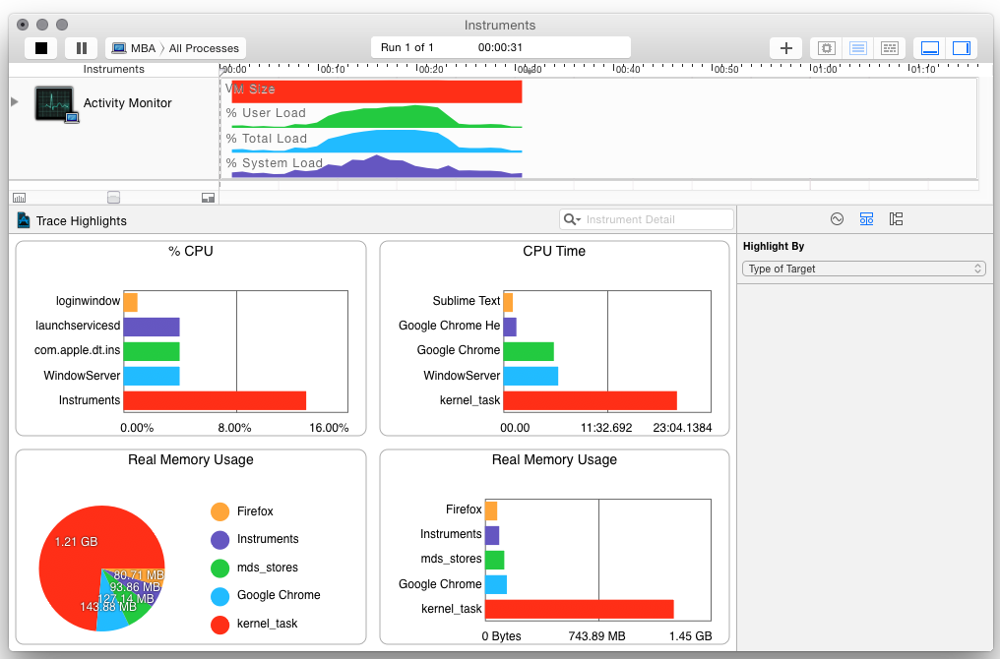

<!-- Rapport final de PFE - Francis Bonneau, automne 2014 -->

# Visualisation temps réel des appels systèmes Linux

## Sommaire

L'objectif de ce projet était d'explorer différentes techniques de visualisation de données pour proposer une méthode différente d'analyse des données reliées à la performance d'applications. L'accent principal était les applications fonctionnant sur Linux, en raison de l'ouverture du système d'exploitation et de sa popularité dans le monde des serveurs.

Idéalement la solution retenue devait également permettre l'analyse de données provenant de plusieurs systèmes différents, afin de pouvoir analyser les systèmes distribués, et ces données seraient envoyées et interprétées en temps réel pour offrir une vue directe de l'activité des systèmes observés. 

Une fois interprétées, ces données seront ensuite affichées à l'usager via une visualisation de données interactive, qui offrirait une vue d'ensemble des données, mais que l'utilisateur aurait la possibilité de rafiner pour avoir plus de détails sur un segment des données. La visualisation de données choisie devrait également faciliter la comparaison des données, que ce soit entre différents systèmes ou différents processus sur le même système.

Après quelques recherches sur les outils existants et différentes techniques pour accomplir ces objectifs, l'architecture élaborée pour y répondre consiste d'un module serveur responsable de la collecte de données, et d'un module client qui analyse les données et affiche celles-ci. Différents patrons de conceptions, tels les patron stratégie, observateur et singleton, ont été utilisés à travers ces modules pour favoriser l'extensibilité et la flexibilité de l'application. 

L'implémentation a donc été réalisée principalement en Java pour la partie client, en utilisant le framework Processing pour l'affichage graphique. La partie serveur utilise Sysdig pour la capture des données, et envoie les données à Redis en temps réel avec système publish-subscribe via un script écrit en Lua. Diverses autres librairies (dont ControlP5, Jedis, GSON, etc.) ont été utilisées au cours du projet pour maximiser la réutilisation de code. 

Somme toute, les différents défis reliés au projet, tel que la performance nécessaire vue la quantité de données à analyser et l'aspect temps réel de la visualisation, ont pu être dans l'ensemble résolus ou contournés pour arriver au résultat souhaité, une application capable de recevoir des données en temps réel de plusieurs systèmes et d'afficher celles-ci.

La réalisation principale suite à la compétition du projet est que malgré l'effort considérable requis, l'utilisation d'un framework comme Processing offre des possibilités inégalées pour la visualisation de données, en raison du contrôle total sur tous les aspects de la représentation graphique, au pixel près. C'est toutefois une arme à deux tranchants, puisque ce contrôle demande beaucoup d'effort pour reproduire des visualisations simples qui sont directement intégrées dans d'autres outils. C'est toutefois une avenue qui mérite d'être explorée, surtout lorsque l'on veut expérimenter différentes approches uniques. 

## Chapitre 1 : Introduction

### 1.1 Description du projet en bref

Ce projet consiste à explorer les différentes méthodes de visualisation de données reliées aux systèmes d'exploitation et de proposer une nouvelle option.

### 1.2 Contexte

Grand nombre d’entreprises ont des applications en production dont la performance de celles-ci est critique. Les requis de performance de ces applications sont tels qu’une tendance actuelle est de concevoir des architectures de nature distribuées, afin que l’application soit exécutée en parallèle sur plusieurs machines. Or, lorsque cette application ne performe pas à la hauteur des attentes ou qu’un problème survient en production, les administrateurs systèmes et développeurs doivent effectuer un diagnostic et localiser la source du problème.

### 1.3 Problématique

Diagnostiquer la source d’un problème de performance d’une application en production, surtout lorsqu'elle est exécutée en parallèle sur différentes machines, peut s’avérer une tâche ardue. D’autant plus si cette application fonctionne sur des systèmes d'exploitation (Operating system, ou OS) de type Linux, sur lesquels souvent le seul accès possible est via un simple terminal en mode texte.

Plusieurs outils en ligne commande existent pour examiner l’activité d’un système Linux, ou l’utilisation des différentes ressources de ce système, mais ceux-ci sont généralement très spécifique, c’est-à-dire qu’ils présentent l’activité en détail qu’une seule partie du système ( comme l’activité sur le réseau ) ou alors ils sont plutôt généraliste et ne présentent qu’un simple aperçu de l’activité des différentes parties du système.

### 1.4 Objectif

L’objectif du projet est de proposer une alternative aux outils de diagnostic existants afin de faciliter l’analyse et la recherche de problèmes liés à la performance. Cette alternative devrait simplifier la tâche d’interpréter l’activité sur un ou plusieurs systèmes Linux, notamment dans le cas où l’application d’intérêt est de nature distribuée.

De plus, ce projet vise à explorer différentes techniques de visualisation de données afin de permettre à l’utilisateur d’explorer les résultats obtenus avec une interface graphique, une approche différente à la plupart des outils existants.

### 1.5 Résultats attendus

* Faciliter l’exploration et l’analyse des données

* Faciliter l’analyse de l’activité d’applications sur un ou plusieurs systèmes

* Diagnostic plus rapide des problèmes liés à la performance

* Gain de connaissances sur les applications et systèmes analysés

* Gain de productivité suite à l’amélioration de la performance

### 1.6 Terminologie

Système d'exploitation : Un système d'exploitation (*operating system* ou OS) est un logiciel qui est prend en charge les ressources matérielles d'une machine et offre ces ressources et d'autres services aux applications des usagers.

Noyau : Le noyau ou *Kernel* est le coeur d'un système d'exploitation, il s'occupe principalement de la gestion du processeur et de la mémoire, ressources qui sont sont partagées aux applications du système d'exploitation. 

Linux : Nom couramment donné à tout système d'exploitation libre fonctionnant avec le noyau Linux. Implémentation libre du système UNIX qui respecte les spécifications POSIX.^[Ref 01]

Processus : Une instance d'un programme en train d'être exécutée.

Daemon : Un processus qui fonctionne en arrière-plan, typiquement pour une durée indéterminée.

Appel système : Un appel système (en anglais, *system call*, abrégé *syscall*) est une fonction primitive fournie par le noyau d'un système d'exploitation et utilisée par les programmes s'exécutant dans l'espace utilisateur (en d'autres termes, tous les processus distincts du noyau).^[Ref 02]

Descripteur de fichier : Un descripteur de fichier ou *file descriptor* est un terme qui désigne une référence à un fichier sur les systèmes POSIX.

Pile d'exécution : la pile d'exécution est une liste des fonctions actives d'un programme. La pile peut également contenir d'autres informations reliées à ces fonctions, tel que l'horodatage et les adresses mémoires.

Temps réel : Un système temps réel est une application ou plus généralement un système pour lequel le respect des contraintes temporelles dans l'exécution des traitements est aussi important que le résultat de ces traitements.^[Ref 03] ^[Ref 04]

Visualisation de données : Domaine informatique multidisciplinaire don’t l’objet d’étude est la représentation visuelle de données.^[Ref 05]

## Chapitre 2 : Analyse de la performance sous Linux

### 2.1 Revue de l'architecture de Linux

Pour obtenir des données sur l'activité d'une application précise il faut  avoir en premier lieu une connaissance de l'environnement où est exécutée cette application, soit le système d'exploitation. Dans ce projet l'emphase est mise sur les systèmes d'exploitation UNIX de type Linux, mais les principes de base restent les mêmes entre les différents OS.

De manière générale, un [système d'exploitation](http://fr.wikipedia.org/wiki/Syst%C3%A8me_d%27exploitation) sert d'interface entre l'accès aux ressources d'une machine et les usagers et applications qui veulent utiliser ces ressources. Grâce à cette interface, les applications peuvent bénéficier de plusieurs services offerts par le système d'exploitation, tel l'ordonnancement, le système de fichier, la sécurité, etc.

Le matériel physique de la machine est donc géré par le système d'exploitation, ou plus précisément [le *Kernel*](http://fr.wikipedia.org/wiki/Noyau_de_syst%C3%A8me_d%27exploitation) ou noyau. En pratique, pour que cette abstraction entre le matériel et les applications soit respectée, le système d'exploitation est généralement divisé en deux sections, l'espace utilisateur et l'espace Kernel. 

Les applications des usagers sont alors exécutées dans l'espace utilisateur, où les permissions sont restreintes, et doivent demander la permission au Kernel pour accéder aux ressources. Ces demandes sont nommées [appels systèmes](http://fr.wikipedia.org/wiki/Appel_syst%C3%A8me), ou *system calls* voire syscalls. Au débuts de UNIX il y avait approximativement 80 appels systèmes, aujourd'hui ce nombre s'élève à plus de 300. 

Parmi les appels systèmes les plus courants il y a [*read*](http://linux.die.net/man/2/read) et son équivalent [*write*](http://linux.die.net/man/2/write) qui permet de lire et d'écrire dans un descripteur de fichier ou *file descriptor*, typiquement un fichier sur le disque. La liste complète est disponible sur plusieurs sites tels que [kernelgrok.com](http://syscalls.kernelgrok.com/), et de l'information spécifique sur chaque appel système est disponible dans le manuel de l'OS (man), typiquement dans la section numéro 2 (`man 2 read`).

Cette architecture divisée en espaces usager/kernel est souvent représentée de la façon suivante :

Tel qu'illustré sur la figure précédente, les applications exécutées par les usagers d'une machine sont le dernier maillon de la chaine, et produisent le résultat attendu. Celles-ci ne peuvent toutefois fonctionner sans l'appui de tous les services implémentés par le système, services que l'application utilise par le biais de librairies ou d'appels systèmes directement. 

Le principal avantage d'une telle architecture est qu'elle permet d'éviter ou de limiter la duplication d'effort. En effet, les développeurs d'applications peuvent se fier aux services offerts par le système d'exploitation et n'ont pas besoin de ce soucier de problèmes liés à la gestion du matériel par exemple, et éviter d'y consacrer des efforts puisque ces problèmes sont déjà gérés par l'OS. Tel que l'a souvent répété [David Wheeler](https://en.wikipedia.org/wiki/David_Wheeler_(British_computer_scientist)), un éminent chercheur en informatique :

> All problems in computer science can be solved by another level of indirection  
­*-- David Wheeler*^[Ref 06]

Les couches d'abstractions offertes par les OS suivent également cette idée.

Puisqu'en pratique les applications n'ont pas besoin de se soucier de l'implémentation de ces couches sous-jacentes, pourquoi s'y intéresser lors de l'analyse de la performance de ces applications ? Cela dépend principalement du type d'analyse considéré. Lors de l'établissement d'indice de références, *benchmarks*, de la performance d'une application spécifique, le matériel et le système d'exploitation peuvent être ignorés - à la seule condition que les autres tests comparatifs soient réalisés sur exactement le même environnement.

Toutefois, lorsque l'objectif est d'améliorer la performance d'une application donnée, ou de résoudre un problème lié à la performance, tout doit être pris en considération. Les résultats obtenus vont varier considérablement selon l'environnement, qu'il s'agisse des différentes couches logicielles - de l'application elle-même jusqu'au Kernel, ou alors du matériel de la machine. De plus, lors de problèmes de performance, si la cause est reliée à du matériel ou des périphériques fautifs, alors c'est au niveau de l'OS qu'il faut regarder, car l'application elle-même ne connait pas l'état de la machine sur laquelle elle fonctionne.

### 2.2 Méthodologies de l'analyse de performance

Ce projet s'intéresse principalement aux analyses de performance reliées à l'amélioration ou la résolution de problèmes, et l'objectif final est de permettre à l'utilisateur d'en apprendre plus sur son application et la façon dont elle interagit avec l'OS pour améliorer celle-ci. L'établissement d'indices de performance, ou *benchmarks* ne sera pas considéré. Ceci dit, explorons les différentes techniques liées à ces types d'analyses. 

Dans son livre *Systems Performance: Enterprise and the Cloud*^[Ref 07], Bredan Gregg propose différentes méthodologies pour procéder à la résolution de problèmes de performance. Celles-ci sont également détaillées sur [son site web](http://www.brendangregg.com/methodology.html). En voici quelques-unes : 

> 6. Ad Hoc Checklist Method
> 7. Problem Statement Method
> 8. Scientific Method
> 9. Workload Characterization Method
> 10. Drill-Down Analysis Method
> 11. Five Whys Performance Method
> 12. By-Layer Method
> 13. Latency Analysis Method
> 14. Tools Method
> 15. USE Method  
> [...]

Deux méthodologies seront principalement utilisées dans le cadre du projet, soit la méthode de caractérisation de la charge de travail *Workload Characterization Method*, et la méthode d'analyse par exploration *Drill-Down Analysis Method*. La caractérisation de la charge de travail consiste à identifier la source et la nature de la charge sur un système, et de suivre son évolution à travers le temps. Un changement soudain de la charge comparée à l'historique peut alors indiquer un problème potentiel, et l'identification du type de charge peut ensuite pointer vers la source. De manière générale, l'analyse par exploration, *Drill-Down*, consiste à examiner une vue d'ensemble d'un système, pour ensuite explorer plus en profondeur les détails d'un secteur d'intérêt en particulier. 

En effet, la solution proposée devrait permettre à un utilisateur de voir une vue d'ensemble du système analysé, et de permettre à cet utilisateur de sélectionner une partie du système qu'il l'intéresse, pour raffiner la vue affichée pour afficher les détails de cette partie. Une *vue* devrait idéalement permettre à l'usager de caractériser visuellement la charge de travail présente sur le système, et possiblement de comparer la charge actuelle à un historique.

### 2.3 Métriques et statistiques

Les métriques de performance sont des statistiques qui mesurent l'activité de différentes parties du système. Généralement il s'agit d'un pourcentage d'utilisation, un nombre d'opérations par intervalle de temps (typiquement des secondes, ex : IOPS, I/O operations per second), ou alors le temps de latence associé à une certaine opération. Les métriques peuvent être calculés directement par le système d'exploitation ou par des applications distinctes. 

Une très grande quantité de métriques peut être collectée à un temps donné sur un système d'exploitation, sans parler des métriques spécifiques aux applications, cela peut résulter en une quantité considérable de données à analyser. Il est toutefois possible d'identifier quelques métriques clés qui peuvent donner une très bonne idée de l'état d'un système. À titre d'exemple, le *Redpaper* de IBM intitulé [*Linux Performance and Tuning Guidelines*](http://www.redbooks.ibm.com/redpapers/pdfs/redp4285.pdf) décrit pour Linux les métriques suivants^[Ref 08] (descriptions en annexe) :

Métriques du processeur                                     Métriques de la mémoire
--------------------------                                  --------------------------
[CPU utilization](#cpu-utilization)                         [Free memory](#free-memory)
[User time](#user-time)                                     [Swap usage](#swap-usage)
[System time](#system-time)                                 [Buffer and cache](#buffer-and-cache)
[Waiting time](#waiting-time)                               [Slabs](#slabs)
[Idle time](#idle-time)                                     [Active vs inactive memory](#active-vs-inactive-memory)
[Nice time](#nice-time)
[Load average](#load-average)
[Runable processes](#runnable-processes)
[Blocked processes](#blocked-processes)
[Context switches](#context-swiches)
[Interrupts](#interrups)
--------------------------                                  --------------------------

Métrique des cartes réseau                                  Métriques des disques
----------------------------                                --------------------------
[Packets received and sent](#packets-received-and-sent)     [IOwait](#iowait)
[Bytes received and sent](#bytes-received-and-sent)         [Average queue length](#average-queue-length)
[Collisions per second](#collisions-per-second)             [Average wait](#average-wait)
[Packets dropped](#packets-dropped)                         [Transfers per second](#transferts-per-second)
[Overruns](#overruns)                                       [Blocks read/write per second](#blocks-readwrite-per-second)
[Errors](#errors)                                           [Kilobytes per second read/write](#kilobytes-per-second-readwrite)
----------------------------                                --------------------------

Les métriques sont utiles lorsque l'on peut les comparer à un historique, et alors constater soit une dégradation ou une amélioration de la performance. 

En pratique, collecter une grande quantité de métriques sur un système en production peut s'avérer utile lors de la résolution de problèmes, mais cela à un certain coût additionnel sur le système instrumenté, qui peut performer moins efficacement dépendamment des cas. 

Une alternative pourrait être de collecter toutes les métriques durant une certaine période, cibler ceux qui sont réellement d'intérêt et de se limiter à ceux-là en production. Rien n'empêche également d'activer l'instrumentation complète suite à un changement dans le système tel un nouveau déploiement, et réduire par la suite l'instrumentation du système une fois sa stabilité établie. 

### 2.4 Données fournies par le Kernel

Les différentes métriques énoncées plus haut peuvent être calculées par défaut par le Kernel (par l'incrémentation de compteurs), ou calculées par d'autres programmes externes. Différentes interfaces sont offertes par le Kernel pour accéder aux données et métriques du système, les deux principales sont les répertoires /proc et /sys. 

En effet, puisque Linux prend à coeur la philosophie UNIX de *tout est un fichier*, ces données sont accessibles comme n'importe quel autre fichier ordinaire du système. /proc est toutefois créé dynamiquement par le Kernel au démarrage du système et n'existe qu'en mémoire vive, son contenu n'est enregistré sur aucun disque.

À titre d'exemple, le répertoire /proc est organisé de la façon suivante : /proc contient un répertoire pour chaque processus sur le système et ce répertoire est nommé selon le pid du processus. 

Ce répertoire contient ensuite quelques fichiers qui eux conservent les données reliées à ce processus, tels les arguments et statistiques.

Quelques fichiers à la racine de /proc ne suivent pas cette nomenclature. Il s'agit soit de propriétés de sous-systèmes du Kernel, ou de fichiers contenant les statistiques globales du système, tel loadavg qui contient une métrique générique de la charge du système pour les dernières minutes. 

Beaucoup d'outils d'analyse de la performance utilisent les répertoires /proc et /sys du Kernel comme source de données sur l'état global du système. Toutefois pour certains besoins spécifiques, tel que la capture d'événements, d'autres interfaces sont offertes par le Kernel, telles les kprobes, ftrace, perf_event, etc.  Cela dépend de la nature de l'outil et du besoin qu'il cherche à combler, tel que détaillé par la section suivante.

### 2.5 Revue des outils existants

Un multitude d'outils existent pour identifier et diagnostiquer des problèmes de performance, ou pour simplement obtenir un portrait de l'activité d'un système. Cette section vise à présenter un aperçu des différents outils disponibles sous Linux. 

#### 2.5.1 Processeur et mémoire

Commençons par les outils les plus génériques, installés par défaut sur tous les systèmes modernes. Ces outils permettent d'obtenir un aperçu de l'activité du système, au moment immédiat ou alors avec un historique, en présentant pour chaque processus son utilisation CPU et sa mémoire.

*ps*, pour process status est probablement le plus simple. Il affiche la liste des processus qui sont présents sur la machine et leurs paramètres, tel l'usager qui l'exécute, le process id, etc. ps affiche peu d'information reliée à la performance - à part l'utilisation CPU, mais c'est souvent le programme de choix pour voir rapidement ce qui fonctionne sur une machine.

Il y a plusieurs autres façons de représenter cette liste de processus, une représentation en arbre comme l'offre *pstree* est également commune. htop, présenté plus loin propose également cette représentation.

L'autre outil le plus répandu est sans aucun doute *top*. top permet de voir comme ps la liste des processus qui tournent, et affiche pour chaque processus l'utilisation CPU et mémoire, en plus d'un indicateur global pour le système. Contrairement à ps, top s'actualise à chaque seconde.

Plusieurs autres programmes se sont inspirés de top et visent à le remplacer en proposant une interface utilisateur plus moderne. Pour n'en citer que deux exemples, *[htop](http://hisham.hm/htop/)* tente de se démarquer par la couleur, et *[vtop](https://parall.ax/vtop)* lui propose un graphique sur lequel il est plus facile de voir l'évolution dans le temps.

Bien que la plupart des outils sont exécutés directement par l'usager, d'autres outils tels que *sar* fonctionne en permanence en tant que daemon sur le système, et visent plutôt à conserver un historique à long terme de l'activité du système. Pour mettre en place le service sur certains systèmes des packages supplémentaires doivent être installés, tel que *sysstat* sur Ubuntu, mais une fois le service établi il est possible d'accéder l'historique avec sar :

#### 2.5.2 Disques et réseau 

top et les autres outils précédents mettent davantage l'accent sur l'utilisation CPU et de la mémoire, or il existe plusieurs autres outils qui les complémentent en permettant de voir l'activité des autres ressources du système, tel que les cartes réseaux et les disques.

Plusieurs outils de la famille \*stat peuvent être utilisés à cet effet. *mpstat* et *vmstat* affichent des statistiques similaires à top, mais *iostat* quand à lui affiche des statistiques sur l'activité des disques durs du système.

*netstat* quant à lui affiche les connexions réseau établies par les processus, très similaire à ps par le fait qu'il n'affiche que peu de statistiques sur les connexions mais c'est souvent la première étape pour déterminer l'état actuel.

*[nload](http://www.roland-riegel.de/nload/)* est un autre outil dédié à l'activité réseau, similaire à vtop du fait qu'il affiche un historique qui est mis à jour à un intervalle régulier.

*[iotop](http://guichaz.free.fr/iotop/)* est l'équivalent de top pour les disques durs. Il affiche l'activité de lecture et écriture sur les disques pour chaque processus et présente une liste des processus avec le plus d'activité.

Un autre logiciel qui mérite d'être mentionné est *[Collectl](http://collectl.sourceforge.net/index.html)*, qui est similaire aux autres outils *stat du fait qu'il affiche les données à un intervalle régulier, mais il se démarque par la quantité de données qu'il peut accéder, Collectl permet de mesurer l'activité d'une quantité impressionnante de sous-systèmes différents, que ce soit la mémoire, les disques, le réseau, et même certaines cartes graphiques. 

#### 2.5.3 Capture d'événements

Les outils présentés jusqu'à présent permettent de mesurer l'activité de différentes parties d'un système donné, et d'identifier avec différents niveaux de succès la source de cette activité, du moins le processus responsable. Or, lorsqu'un problème survient sur un processus critique du système, et qu'il faut identifier ce que fait ce processus et la source du problème, il faut parfois plus de données. Une façon d'obtenir ces données est par l'utilisation de logiciel de traçage ou *tracing*, qui eux peuvent capturer les événements en temps réel et afficher ceux-ci.

La définition d'un événement peut varier selon l'outil, mais typiquement il s'agit d'une interaction entre un processus et le système d'exploitation à un instant précis. Cette interaction prend souvent la forme d'un appel système, et dans ce cas il s'agit alors d'une requête par le processus suivie d'une réponse par le système quelques instants après. Par exemple un processus peut envoyer une requête de lecture *read* pour accéder aux derniers octets du fichier /var/log/syslog, et le système va répondre en envoyant les quelques octets demandés peu de temps après.

Juste le fait de pouvoir observer en temps réel les différentes requêtes d'accès au système de fichiers ou au réseau permet d'en apprendre beaucoup sur l'état du processus et d'analyser son comportement pour voir si il réagit comme il le devrait. *strace* est un outil disponible par défaut sur presque tous les systèmes Linux et qui permet de faire exactement cela, il suffit de lui indiquer le pid du processus à analyser, et il va afficher les appels systèmes de ce processus au fur et à mesure que ceux-ci surviennent.

Il existe toutefois plusieurs autres outils similaires à strace qui ajoutent d'autres fonctionnalités plus avancées, tel que la possibilité d'injecter des sondes ou *probes* ( des fonctions personnalisées qui sont exécutées lorsque qu'un certain événement arrive) directement dans le kernel, afin de capturer des données plus spécifiques à certaines conditions. *[Dtrace](http://dtrace.org/blogs/about/)* est probablement l'un des outils les plus avancés de cette catégorie, mais comme il à été initialement développé pour Solaris son support Linux n'est pas aussi stable. Plusieurs outils similaires ont été développés pour Linux, tel *[SystemTap](https://sourceware.org/systemtap/)*, *[perf](https://perf.wiki.kernel.org/index.php/Main_Page)*, *[LTTng](https://lttng.org/)* et *[Sysdig](http://www.sysdig.org/)*.

Sysdig est intéressant puisqu'il est relativement simple d'utilisation, et donne accès à une grande variété de fonctions déjà écrites (appelées *[Chisels](https://github.com/draios/sysdig/wiki/Chisels-User-Guide)*) pour afficher les données capturées. Par défaut, lorsqu'il est exécuté, il affiche tous les événements du système (voir figure suivante) et de tous les processus, mais il offre une grande variété de filtres pour raffiner l'information affichée. En raison de ces fonctionnalités, c'est l'outil qui sera utilisé dans ce projet pour la capture des données.

#### 2.5.4 Diagramme des outils disponibles

Pour résumer cette section sur les différents outils de capture de données disponible sous Linux, cette carte réalisée par Brendan Gregg s'avère très utile pour énumérer bon nombre d'outils et leurs spécialités. Il s'agit d'un diagramme de l'architecture de Linux, sur lequel des flèches identifient quels outils peuvent être utilisés pour analyser cette section du système. Voir [brendangregg.com/linuxperf.html](http://www.brendangregg.com/linuxperf.html) pour plus de détails^[Ref 09].

### 2.6 Approches graphiques

Une grande majorité des outils disponibles pour l'analyse et la capture de données reliées à la performance de système Linux sont des outils en ligne de commande. Ceux-ci présentent l'information directement sous forme de texte, ou utilisent certaines techniques avec des caractères spéciaux pour afficher des diagrammes à barres, ou des histogrammes directement dans le terminal.

Les outils avec des interfaces graphiques complètes sont moins communs. Souvent une combinaison d'outils en ligne de commande pour la capture de données et un autre système tel que *[RRDtool](http://oss.oetiker.ch/rrdtool/)* ou *[Graphite](http://graphite.wikidot.com/)* pour le stockage et l'affichage de graphiques est la solution retenue pour sa flexibilité. Cette flexibilité s'avère utile lorsqu'il faut analyser la perfomance de plusieurs machines et pouvoir visualiser les données dans un contexte qui permet de les comparer.

Cette section présente donc quelques-uns des outils existants pour visualiser des données reliées à la performance. 

#### 2.6.1 Logiciels intégrés

Les logiciels avec interfaces graphiques dédiées à la performance les plus courants sont probablement les outils embarqués par défaut sur plusieurs systèmes d'exploitation. Ces outils sont généralement moins orientés serveurs, et ceux-ci permettent typiquement de voir la liste des processus de façon similaire à top, mais avec une interface graphique. À titre d'exemple voici à quoi ressemblent le *Activity Monitor* de OSX et le *System Monitor* de Ubuntu.

#### 2.6.2 Interfaces graphiques aux outils de traçage

Il existe également quelques interfaces graphiques à certains outils mentionnés précédemment, tels les programmes de traçage comme Dtrace et System Tap. Ces interfaces graphiques sont intéressantes puisqu'elles peuvent aider à réduire la courbe d'apprentissage reliée à ces outils avancés. L'interface graphique peut offrir des raccourcis pour les analyses courantes et ainsi éviter à l'usager d'avoir à écrire lui-même ses fonctions (probes) pour arriver au résultat désiré. Apple offre notamment une interface graphique à Dtrace, nommée Instruments, qui permet d'instrumenter des applications sur OSX et d'afficher graphiquement le résultat. SystemTap GUI est un autre projet similaire pour SystemTap, et propose un environnement de développement intégré pour l'écriture de scripts et fonctions stap. 

#### 2.6.3 Autres visualisations

Outre les interfaces graphiques aux outils existants, plusieurs autres façons de visualiser l'information collectée ont été imaginées, cette section présente quelques-unes de ces approches différentes, mais très intéressantes.

##### 2.6.3.1 Flame Graphs

Une façon différente de représenter l'historique de la pile d'exécution d'un processus à un instant donné, collecté par les outils de traçage comme Dtrace à été développée par Bredan Gregg^[Ref 10], il s'agit des *[Flame Graphs](http://www.brendangregg.com/flamegraphs.html)*. Il s'agit d'une visualisation qui vise à mettre en évidence les chemins les plus couramment visités dans le code d'une application. Un script en prend argument un fichier contenant des données captures par Dtrace ou SystemTap, et produit en sortie le diagramme sous la forme d'un fichier svg, qui ressemble typiquement à ceci :

Voici comment interpréter un Flame Graph : 

> The x-axis shows the stack profile population, sorted alphabetically (it is not the passage  of time), and the y-axis shows stack depth. Each rectangle represents a stack frame. The wider a frame is is, the more often it was present in the stacks. The top edge shows what is on-CPU, and beneath it is its ancestry. The colors are usually not significant, picked randomly to differentiate frames.  
-- Bredan Cregg^[Ref 10]

##### 2.6.3.2 vistrace

*[vistrace](http://home.in.tum.de/~xiaoh/vistrace.html)* est un autre type de visualisation relié cette fois-ci aux appels systèmes interceptés par strace, réalisée par Han Xiao^[Ref 11]. vistrace affiche les différents appels systèmes capturés sur un graphe circulaire, puis met en évidence l'ordre des appels et le délai entre la requête d'un appel système ainsi que la réponse retournée par le système - en reliant ces deux événements par une ligne. 

Voici la description de la visualisation par Han Xiao  : 

> vistrace visualizes the output produced by strace -ttt cmd as a circular graph.   
> Each system call has a unique color (there are in total 380 UNIX system calls);  
> System calls were plotted in clockwise (i.e. starts and ends at the 12 clock position);  
> A line is plotted between two functions if the return value of the first function was used as an argument of the second function;  
> Functions that returned -1 (error) were omitted;  
> Maximum 2000 system calls were plotted.  
-- Han Xiao^[Ref 11]

### 2.7 Description de l'approche de collecte de données choisie

Comme l'objectif de ce projet est de permettre d'interpréter plus facilement les données liées à la performance d'un ou plusieurs systèmes, il faut évidemment collecter ces données. Or compte tenu du fait qu'il existe plusieurs outils très avancés pour la collecte des données, il a été choisi de réutiliser un des outils existants pour cette phase, quitte à bâtir un pont entre ce système et le reste de l'application - qui servira alors uniquement à interpréter et visualiser les données.

La question suivante se pose alors : quels type de données (de performance) faudrait-il collecter et avec quel outil ? Comme il faudra présenter un aperçu complet du système instrumenté, il faudrait en premier lieu un outil capable de mesurer tous les processus simultanément. De plus, il faudrait permettre à l'utilisateur de pouvoir 'raffiner' la visualisation sur un processus précis, ce qui implique que l'outil devrait être capable de filtrer les données collectées. Or les données collectées devraient être suffisamment précises pour pouvoir analyser le comportement d'un processus, c'est-à-dire qu'une approche où tous les événements, tels les appels systèmes, sont collectés serait à privilégier à l'opposé d'un simple enregistrement du pourcentage d'activité d'un processus. L'outil qui à été retenu pour satisfaire ces conditions est Sysdig.

L'avantage des appels systèmes est que l'analyse de ceux-ci est très instructive sur les activités d'un processus, mais comment peut-on utiliser les appels systèmes pour effectuer des comparaisons ? Ou déterminer une amélioration ou régression de la performance d'un processus, outre regarder la quantité d'appels systèmes envoyés ? 

Une solution potentielle serait d'examiner le temps de latence des appels systèmes. En effet, la différence de temps entre la requête et la réponse est nommée temps de latence, car le programme peut être obligé d'attendre la réponse avant de poursuivre ces opérations, ce qui le ralentit. Évidemment le système tente de minimiser le temps de latence des opérations, mais cela peut varier fortement dépendament de plusieurs facteurs, telle la charge globale - la quantité de requêtes que le système reçoit à chaque seconde, la priorité variable des différentes requêtes, etc. 

La latence varie également selon le matériel employé, un disque dur ordinaire va certainement prendre plus de temps à récupérer les données qu'un disque de type SSD. Malgré cela, la latence pour une requête typique est tout de même très petite, vu qu'elle est souvent mesurée en nanosecondes. Le ralentissement d'un programme dépend beaucoup de la quantité de requêtes qu'il effectue, et bien entendu du temps de latence de chaque de ces requêtes. 

Une des fonctionnalités de sysdig, les scripts personnalisés par l'usager nommmé *Chisels*, permet justement d'écrire une fonction capable d'enregistrer les données d'intérêt, tel que le temps de latence pour chaque événement, et ces données pourront ensuite être envoyées vers le reste du système pour être analysée. Or c'est là que la visualisation des données va s'avérer très utile, car Sysdig et les outils de traçage produisent une très grande quantité de données en très peu de temps.

À titre d'exemple, exécuter Sysdig sans arguments sur un système ordinaire Ubuntu Desktop pendant approximativement 1 minute à produit un fichier texte de **384 Mégaoctets**, soit **4 383 538 lignes de texte** (1 appel système par ligne). Analyser cette quantité de données directement demande un investissement considérable de temps par l'usager, et en pratique on n'a souvent pas le choix de mettre des filtres pour réduire cette quantité d'information à potentiellement ce qu'on recherche. On perd alors la vision globale de l'état du système. Or c'est des objectifs du projet, soit de proposer une alternative qui va permettre d'analyser ces données plus rapidement, par la visualisation de données.

## Chapitre 3 : Visualisation de données

### 3.1 Objectif

La visualisation de données comporte de nombreux aspects, qui sont éloquemment représentés par cet infographique réalisé par la firme FFunction^[Ref 12] :
 

Or l'objectif de l'utilisation de la visualisation de données dans le contexte de ce projet est principalement d'aider l'utilisateur à analyser les données sur les systèmes analysés, afin de mieux comprendre l'état de ceux-ci. Si possible, il faudrait également permettre l'identification de problèmes potentiels de performance, et de pouvoir cibler la source de ces problèmes. Si en utilisant l'application l'usager peut augmenter ses connaissances du fonctionnement de Linux et des applications d'intérêt alors une grande partie de l'objectif sera tout de même atteint.

### 3.2 Bonnes pratiques

La visualisation de données, bien qu'elle aide généralement à l'analyse et la compréhension, n'est pas infaillible. Des erreurs liées à la représentation peuvent confondre l'usager sur le phénomène observé, et mener à des fausses conclusions. La référence probablement la plus reconnue sur le sujet est le livre de Edward Tufte, *The Visual Display of Quantitative Information*. Dans ce livre Tufte présente plusieurs bonnes pratiques à suivre lors de la création d'une représentation graphique de données. En voici quelques unes énumérées dans le premier chapitre^[Ref 13], et une interprétation de celles-ci : 

* Montrer les données : le graphique doit avant tout illustrer les données, dans un contexte qui facilite la compréhension de celles-ci.

* Inciter le sujet à réfléchir sur le sujet : mettre l'emphase sur le contenu et non sur la forme, éviter les éléments qui détournent l'attention des données elles-mêmes.

* Éviter de distorsionner les données : celles-ci doivent être représentées de manière précise.

* Présenter beaucoup de chiffres (d'information) dans un espace restreint : maximiser l'information dans l'espace alloué (data-ink ratio).

* Encourager la comparaison des données : possiblement en offrant une visulisation interactive, ou l'usager peut choisir les données à comparer.

* Représenter les données avec différents niveaux de détails  : afin que l'utilisateur puisse avoir une vue d'ensemble de la situtation, et permettre à l'usager de mettre l'emphase sur une section pour avoir plus de détails.

L'approche choisie pour ce projet, détaillée plus bas, tente de respecter le plus possible ces bonnes pratiques.

### 3.3 Description des défis reliés à la visualisation

Suite à l'analyse précédente des différentes métriques disponibles, il à été établi que les données à collecter et à visualiser dans le cas présent seraient principalement le temps de latence des appels systèmes du ou des machines à analyser. Or, une fois ces données collectées, la visualisation de celles-ci propose plusieurs défis : 

* La quantité de données est considérable. Lors du test réalisé précédemment, Sysdig a collecté environ 4 300 000 événements en une minute, soit ­~70 000 événements par seconde . On calcule le temps de latence comme la différence entre l'appel système (l'événement) d'entrée et de sortie, alors on divise ce nombre par 2 et on obtient alors 35 000 'points' ou 'mesures' à afficher à chaque seconde. La solution devra proposer une façon qui permettra à l'utilisateur de suivre autant d'activité sans être accablé par celle-ci.

* Les données présentent plusieurs dimensions. Dans le cas où la solution sera utilisée pour surveillée plusieurs machines, chaque événement va être attaché à une machine, un usager local, un processus, un type d'appel système. Il devrait être possible de filtrer l'information selon ces dimensions.

* Chaque dimension comporte plusieurs catégories, voire un très grand nombre de catégories. Le nombre de systèmes surveillés dépendra des choix de l'utilisateur, toutefois le nombre de processus sur la machine analysée peut varier considérablement, typiquement entre 10 et 100 processus, mais peut être beaucoup plus élevé. Le nombre d'appels systèmes est fixe, mais il y a environ 300 catégories de différents appels systèmes. Il sera difficile de représenter visuellement autant de catégories, si on prend des couleurs à titre d'exemple, il est typiquement difficile de les distinguer passé 6-8 couleurs. 

Différents approches peuvent être envisagées pour contourner le problème de la grande quantité de dimensions et de catégories, du fait que certaines propriétés visuelles de la représentation (telles la position, la taille, la couleur, etc.) peuvent représenter fidèlement plus de valeurs de que d'autre. Autrement dit, certaines propriétés visuelles d'un graphique peuvent être plus facilement distinguées par l'utilisateur, elles peuvent donc représenter plus de valeurs. Le diagramme suivant par Noahg Iliinsky^[Ref 14] liste ces différentes propriétés et une estimation du nombre de valeurs différentes qu'elles peuvent représenter :

La solution devra prendre en considération ces différentes propriétés pour arriver à représenter les données de la façon la plus efficace possible, en respectant les bonnes pratiques d'énoncées à la section 3.2.

### 3.4 Revue des approches courantes

Si on simplifie le problème un instant et qu'on imagine le cas le plus simple, une visualisation du temps de latence d'un seul type d'appel système (ex: read), par un seul processus (ex: apache) par un seul usager sur une seule machine. Comment représenter graphiquement ce temps de latence, qui varie dans le temps puisque chaque seconde ce processus effectue plusieurs requêtes au système d'exploitation ? Le moyen le plus simple est un diagramme à ligne, sur lequel l'axe des X représente la latence et l'axe des Y le temps. Comme ceci (données aléatoires pour l'exemple) : 

Ce diagramme fait le travail, puisqu'il permet de comparer la variation de la latence dans le temps, lorsqu'on n'a qu'une seule dimension - un seul appel système et un seul processus. Toutefois il y a déjà quelques inconvénients à l'utilisation de ce graphique en ligne, qui vont apparaitre avec une bonne quantité de données. 

Premièrement avec grand nombre de points à chaque tranche de temps (axe des X), s'il y a des variations considérables dans les données (si par exemple la moitié des appels systèmes ont une latence aux alentours de 100ns et l'autre moitié aux alentours de 400 ns), la ligne risque de tellement bouger qu'il sera impossible de la suivre. Le même phénomène survient si la majorité des données est homogène, mais présente quelques importantes variations. Ce qui peut arriver lorsque les temps des appels systèmes sont mesurés avec une très grande précision, tel que des nanosecondes. Pour remédier à cela, on peut soit utiliser des percentiles pour filtrer les variations trop importantes, ou alors oublier les lignes et simplement tracer les points : 

Le diagramme à nuage de points risque d'être plus facile à lire dans ce cas, et il permettra de voir rapidement les groupes et concentrations de points. Toutefois ce n'est pas certain que le graphique va rester lisible si on dessine les 35 000 points par intervalle de temps, si les points sont très rapprochés, voir superposés, on perd alors une partie de la qualité de la visualisation car on n'est plus en mesure d'évaluer facilement la quantité relative de points à des positions différentes. De plus, cela demande beaucoup de ressources pour afficher autant de points, ce qui est moins intéressant si on veut avoir une visualisation en temps réel. 

Une possible alternative serait alors de considérer un diagramme de type *heat map*, qui est très similaire aux nuages de points, sauf que l'espace du graphique est divisé en rectangles, et les points dans le même rectangle (dans le même intervalle de valeurs) sont regroupés, et ce rectangle prend alors une couleur qui représente la quantité de points présents dans cette zone. L'avantage principal des heat maps est que ceux-ci restent faciles à lire peut importe la quantité de points représentés et demandent également beaucoup moins de ressources lors de l'affichage. Brendan Gregg à notamment développé plusieurs outils pour réaliser des heat maps à partir de captures d'outils de traçage, voici un exemple tiré de son site web^[Ref 15] : 

Toutefois, un des requis de la solution est de permettre la comparaison des données. Les heat maps sont très intéressants lorsque l'on à une seule dimension à visualiser, mais dans notre il faudrait pouvoir être en mesure de comparer et explorer les différentes dimensions des données, ce qui n'est pas possible avec une seule heat map. C'est possible avec les diagrammes à ligne et les diagrammes à nuages de points, car on peut ajouter d'autres lignes ou points de différentes couleurs pour la comparaison des catégories, alors que l'attribut de la couleur est déjà employé dans un heat map. 

Par contre, il est certain qu'avec un grand nombre de catégories, placer tout cela sur le même diagramme va résulter également avec quelque chose de peu lisible, peu importe que ce soit des points ou des lignes. Il faut alors considérer de répartir les données sur plusieurs diagrammes, chaque diagramme représentant une dimension ou un aspect des données différent. Cette technique n'est pas mauvaise en soi, cela va donner un tableau de bord ou *dashboard*, ce qui est de plus en plus utilisé. Cela reste tout de même un compromis entre représenter moins d'information pour que celle-ci soit claire, et perdre une partie de la vue complète du système.

Il n'y a pas de solution idéale à ce problème de représentation des données, étant donné la quantité de données, le nombre de catégories et de dimension, c'est effectivement un problème difficile à résoudre sans faire de compromis. Peu importe le type de visualisation, il faut considérer le contexte de celle-ci, c'est-à-dire la question qu'on cherche à répondre, et trouver la technique de représentation qui convient le mieux. Sur le sujet, le diagramme réalisé par Andrew Abela^[Ref 16] est fort intéressant Pisqu'il indique quels sont les différents types de graphiques qui sont le plus approprié selon l'objectif de la visualisation : 

### 3.4 Description de l'approche de visualisation des données choisie

Après avoir exploré les différents techniques de visualisation de données possibles, cette section présente la méthode qui a été choisie pour interpréter les données collectées. Dès le début du projet, plusieurs prototypes ont été explorés pour représenter l'information souhaitée, en premier lieu avec plusieurs esquisses sur papier. Voici quelques artéfacts de ces premières explorations. 

Comme on peut le constater sur la figure 30, dès le début les différentes dimensions ont été identifiées et quelques idées ont été émises sur les attributs visuels qui pourraient les représenter, telles la couleur, la position, etc. Comme il s'agit de représenter l'activité d'une section de l'architecture du Kernel Linux, l'idée de se servir d'un cercle pour illustrer le Kernel à été reprise de nombreux diagrammes qui documentent cette architecture.

Toutefois comme la visualisation vise à afficher l'activité en temps réel, ce cercle ne sera pas statique, mais va plutôt s'animer de façon à représenter les événements qui traversent le Kernel. Considérant la quantité d'événements à afficher, une des façons les plus courantes d'aborder le problème est de représenter chaque événement comme une simple forme tel un point, couramment appelée *particule*, pour former un *système de particules*. Le livre [*The Nature of Code*](http://natureofcode.com/) de Daniel Shiffman a d'ailleurs un très bon chapitre^[Ref 17] sur le sujet. 

L'avantage d'un système de particule est que celui-ci peut offrir une vision complète de l'état du système, et on peut ajouter à cette vue la possibilité de zoomer sur une zone spécifique, en ajoutant un mécanisme d'intéraction à l'usager. L'idée de pouvoir diviser le cercle en section en utilisant la position pour représenter une catégorie comme un diagramme à pointe de tarte ou *pie chart* est également considérée pour mettre en évidence certains aspects des données, telle la répartition de l'ensemble des événements par catégories, comme le nom du processus ou le type d'appel système. 

Un des avantages des diagrammes circulaires de type *pie chart* est que ceux-ci sont relativement compacts, or cet aspect peut être utilisé pour représenter plusieurs systèmes d'exploitation différents en même temps. Ce qui permettrait d'avoir une vue complète d'un groupe de serveurs, voire d'un centre de données au complet. 

Avant de pouvoir traiter et afficher les données de différents serveurs, il faut que le logiciel soit en mesure de se connecter à ceux-ci pour récupérer l'information. Or cette esquisse présente un aperçu de l'interface utilisateur qui sera développée pour permettre à l'utilisateur d'établir des connexions vers les serveurs à instrumenter, et ensuite régler le nombre de systèmes de particules en conséquence.

Autre possibilité qui vient du fait de pouvoir afficher plusieurs systèmes de particules, ceux-ci peuvent également être utilisés pour représenter différemment l'information du même système, afficher par exemple la répartition des appels systèmes par processus dans un premier cercle, et la répartition des appels systèmes par type (read, write, etc.) dans un second cercle.
  

### 3.5 Attributs de la visualisation des données choisie

En résumé, voici les choix qui ont été fait pour représenter visuellement les différentes dimensions des données. Une fois qu'il à été déterminé que les événements sont représenté avec une particule (simple forme 2D, point ou cercle), les différentes propriétées des événements sont transmises aux particules via les attributs suivants : 

* Position des particules : Les particules apparaissent au centre du cercle au fur et à mesure que des nouveaux événements sont reçus du serveur. Celles-ci ne sont pas statiques toutefois, elle se déplacent vers l'extérieur du cercle, et leur direction (l'angle) est déterminée en fonction de la distribution des événements. Plus précisement, le cercle est divisé en sections, de tailles relatives au nombre d'événements de chaque catégorie, puis les nouvelles particules sont réparties dans l'espace correspondant à leur catégories respectives.

* Mouvement des particules : Les particules se déplacent donc avec une direction déterminée par la distribution des événements, toutefois la vitesse de celles-ci correspond à une autre dimension des données, soit le temps de latence des événements. En effet, la vitesse des particules est inversement proportionnelle au temps de latence des événements représentés. Plus la latence est élevée, moins la vitesse de la particule sera grande. Ou plutôt plus la latence est basse (l'opération c'est déroulée rapidement), plus la vitesse est élevée. L'idée derrière ce lien est que les événements avec un plus grande latence vont être affichés plus longtemps à l'écran, ce qui va permettre à l'utilisateur de les identifier plus facilement, et comme ce sont ces événements qui ralentissent le système, c'est en théorie ceux là que l'usager voudra trouver pour savoir où concentrer les efforts d'optimisation. 

* Taille des particules : La taille des particule représente le nombre d'événements similaires regroupés. Cela dépend toutefois du choix de l'usager quant au paramètre de la précision de la latence. Avec ce réglage il est possible de spécifier avec quelle précision les événements de même type mais avec des temps de latence différent peuvent être regroupés, par exemple regrouper toutes la latences à la miliseconde près, la microseconde près ou alors aux 100 nanosecondes. La latence de ces événements est alors arrondie et ces événements sont représentés avec une seule particule, mais dont la taille est agrandie en fonction du nombre d'événements regroupés. Il est certainement possible de désactiver cette représentation, en spécifiant un arrondissement de 1 nanoseconde, le maximum de précision, ce qui aura pour effet qu'un aucun regrouprement sera fait, toutes les particules vont représenter 1 événement. Toutefois cela va demander significativement plus de ressources lors de l'exécution de l'application cliente. 

* Couleur des particules : La couleur dans la visualisation est utilisée pour distinguer les différentes catégories. Les catégories peuvent être  soit les noms des processus, des usagers ou alors des appels systèmes, mais toutes les catégories ne peuvent appartenir qu'à un de ces trois types à un instant donné, présenement si le type catégorie est changé la visualisation est redémarrée et les couleurs sont réinitialisées. Une couleur représente donc une catégorie donnée, l'étiquette de cette catégorie sera donc écrite avec cette couleur, les particules vont être dessinées avec cette couleur, et les informations supplémentaires sur les particules, affichés si l'usager sélectionne une particule avec sa souris, vont également être affichés avec cette couleur. 

Tous ces différents attributs encodés dans la visualisation de données peuvent s'avérer complexes pour un nouvel utilisateur qui commence tout juste à utiliser l'application. C'est pourquoi un menu d'aide est affiché dès l'ouverture de l'application, et ce menu explique en détails les différents aspects de la visualisation présentés ci-haut. L'usager peut cacher ou afficher le menu d'aide en tout temps lors de l'utilisation de l'applicaiton, et voici à quoi ce menu ressemble : 

### 3.6 Avantages et inconvénients

### 3.7 Alternatives possibles

## Chapitre 4 : Conception du logiciel

### 4.1 Défis rencontrés

La solution souhaitée présente plusieurs défis qui devront être résolus par l'architecture élaborée. La qualité du logiciel, sa flexibilité et capacité d'adaptation aux changements futurs vont en effet dépendre de l'architecture choisie. 

L'architecture du logiciel peut être divisée en deux principaux modules, un module serveur - responsable de la collecte des données, et un module client qui devra interpréter les données et afficher celles-ci. Or ces deux modules présentent des défis différents. Du point de vue serveur, le principal défi est de concevoir une méthode d'acheminer les données collectées au module client, un protocole qui sera idéalement assez flexible pour supporter des connexions de N clients à N serveurs, c'est-à-dire que l'application cliente doit pouvoir se connecter à plusieurs serveurs simultanément pour recevoir leurs données, et inversement un serveur doit pouvoir supporter plusieurs connexions clientes simultanément. De plus une certaine robustesse doit être présente dans le module serveur pour que les données soient idéalement disponibles sur demande, peut importe quand.

Du côté client, le problème consiste plutôt à concevoir une architecture flexible pour que si des besoins additionnels sont manifestés par les usagers dans le futur, il soit possible d'ajouter des fonctionnalités avec un minimum d'impact sur le code. Ces ajouts de fonctionnalités risquent fortement d'être au niveau de l'interface utilisateur ou de la visualisation de données, mais il peut s'agir également de changement au niveau du traitement des données, tel l'ajout du support pour d'autres sources de données.

### 4.2 Architecture choisie

Cette section décrit en détail l'architecture choisie pour répondre aux exigences.

### 4.2.1 Vue d'ensemble

Pour illustrer cette intéraction entre la partie serveur et la partie cliente de l'application, le diagramme suivant montre les principales étapes de l'établissement des connexions :

Tel que mentionné précédemment, le serveur doit être en mesure d'accepter de nouvelles connexions en tout temps, et transmettre les données aux clients aussi longtemps que ceux-ci restent connectés. Les connexions seront de durées variables, cela peut varier de quelques minutes dans le cas d'un usager souhaitant simplement avoir aperçu du système à une très longue durée dans le cas d'un dashboard affichant l'information d'un ou plusieurs systèmes en permanence.

### 4.2.2 Architecture module serveur

La technique choisie pour gérer ces connexions est le patron de conception publish-subscribe : 

> In software architecture, publish–subscribe is a messaging pattern where senders of messages, called publishers, do not program the messages to be sent directly to specific receivers, called subscribers.  
> -- Wikipedia^[Ref 18].

Ce patron de conception convient parfaitement au problème courant puisqu'il offre la flexibilité nécessaire pour permettre des connexions dynamiques entre les clients et serveur. Différentes implémentations de ce patron sont disponibles, mais après quelques recherches il s'est avéré qu'une façon simple d'ajouter la fonctionnalité au module serveur serait de recourir à un service dont le protocole serait supporté par presque tous les langages de programmation, l'idéal pour bâtir un pont entre la collecte de données de Sysdig et le reste de l'application. 

Ce service (ou plus précisément, serveur de données) avec la fonctionnalité pusblish-subscribe est [Redis](http://redis.io/), qui offre un mécanisme nommé PUBSUB avec quelques commandes pour utiliser ce système d'envoi de message. Redis va donc s'occuper de gérer les connexions client et Sysdig lui de la collecte des données. Pour connecter les deux, c'est-à-dire envoyer les données collectées à Redis pour qu'elles soient consommées par les clients, il est possible de tirer avantage d'une fonctionnalité de Sysdig, qui permet d'écrire des scripts en Lua (nommés chisels) pour traiter les données - ou l'envoi de celles-ci à Redis. L'architecture du module serveur va donc ressembler à la figure suivante :

De cette façon les données sont encodées ou sérialisées à la source par le script lscv-chisel, et sont transportées sur le réseau par le protocole natif de communication de Redis. L'avantage de cette approche est que celle-ci reste flexible, les données peuvent être consommées facilement par à peu près n'importe quelle application cliente, suffit que celle-ci utilise un libraire pour accéder à Redis, et que les données soient encodées dans un format bien supporté, tel JSON ou XML.

Le processus de Redis est géré (démarrage automatique et statuts avec /etc/init.d/) par défaut avec les scripts fournis, alors il ne va rester qu'à écrire le script d'envoi des données (lscv-chisel) ainsi que du code pour encadrer le fonctionnement de Sysdig et le chargement du script.

La performance est un enjeu important du projet, du fait qu'une grande quantité d'événements peut être reçue en peu temps. Or le choix de Redis dans ce scénario est également confirmé par sa réputation,  Redis est généralement considéré comme étant très performant. Selon la documentation officielle de Redis, la complexité de l'opération d'envoi de message est O(N+M)^[Ref 19] où N est le nombre de clients connectés au canal et M le nombre de clients connectés au total. Il reste à voir si cela va suffire pour traiter toutes les données, ou si un autre module va agir comme goulot d'étranglement.

### 4.2.3 Architecture module client

L'architecture du côté du client est plus complexe que le serveur à cause notamment de la gestion de l'intéraction avec l'utilisateur. Pour gérer cette complexité, et aider à séparer les différentes fonctionnalités de l'application, son architecture est principalement basée sur le modèle MVC, Modèle-Vue-Contrôlleur. L'idée est de regrouper tout le code relié au traitement des données dans le modèle, le code de l'interface utilisateur dans les vues et l'interaction entre les deux est géré par les contrôleurs. Un existe plusieurs variantes de cette architecture, mais l'idée générale est de segmenter le code pour éviter d'avoir à tout modifier lors de changements liés à l'interface utilisateur. 

Le schéma suivant montre la conception initiale de l'application. D'autres classes ont été ajoutées au cours de l'implémentation pour répondre à différents besoins, mais la structure est restée la même. 

Initialement beaucoup d'effort a été mis sur la conception de la section Modèle de l'application, où les données sont reçues et traitées puisque c'est la partie la plus évidente pour commencer à développer et tester le tout. Différents patrons de conceptions ont été utilisés dans cette section, afin notamment de supporter différentes sources de données, et de manière générale d'être plus flexible. 

Comme les données reçues sont en réalité une série d'événements, une fois traitées c'est une liste d'objets de type Event qui sont envoyés du modèle au reste de l'application. En pratique, c'est une classe qui implémente l'interface DataSource (patron Stratégie pour supporter différentes sources de données) qui va établir le canal avec Redis et recevoir les données. Comme la réception des données est asynchrone, le patron Observateur est utilisé pour que la DataSource notifie le DataAggregator quand des nouvelles données sont reçues. Chaque DataSource se doit d'être indépendant, soit d'être exécutée dans un thread différent pour que la gestion d'événements concurrents soit possible. C'est la classe DataAggregator qui regroupe les données de différentes sources et qui envoie ces données aux vues. 

Le coeur de l'application, l'objet MainLoop qui contient la classe Main est celui qui va initialiser toutes les composantes de l'application. Celle-ci agit donc en tant que contrôleur pour les vues. À noter que les variables d'état partagées globalement sont conservées dans un objet nommé Params, qui utilise le parton Singleton pour s'assurer qu'une seule instance existe en tout temps. Parmi ces variables se retrouvent les paramètres de l'interface utilisateur, qui sont utilisés à différents endroits et qui doivent être gardés synchronisés. Du fait que toutes ces variables d'état sont regroupées, cela devrait faciliter l'ajout de fonctionnalités dans le futur tels la sauvegarde et le chargement des paramètres courants, ou l'ajout d'une autre interface tel un API pour les modifier directement.

Ce n'est pas évident dans ce diagramme mais une très grande partie de l'effort de développement sera consacrée uniquement aux vues, soit sur l'aspect de l'affichage et la représentation des données. C'est sûr que le but premier de cette application est de permettre la visualisation des données, mais comme cette section va évoluer considérablement au fil du développement et de l'expérimentation il est difficle de prévoir d'avance la structure que vont prendre les vues. 

De plus, par leur nature les vues seront difficiles à réutiliser dans d'autres contextes, du fait que le code sera spécifique à situation présente, contrairement au code du modèle voire des contrôleurs. Tout de même il est certain que le code des vues sera organisé en différentes classes comme le reste du programme, et d'emblée il semble correct que les principaux concepts de la visualisation de données aient chacun une classe différente pour séparer le code. Ainsi comme les événements sont représentés sous forme de particules, une classe Particle est liée à un Event, un groupe de particules provenant d'une même source sont conservées dans la classe Emitter, et puisque plusieurs sources de données peuvent être affichées en même temps, les Emitters sont regroupés dans la classe Hud.

## Chapitre 5 : Implémentation du logiciel

### 5.1 Outils utilisés

Différents outils ont été utilisés au cours de la réalisation de ce projet, les principaux sont les suivants : 

Outils liés au développement

* [Eclipse](https://eclipse.org/) - développement Java
* [Sublime Text](http://www.sublimetext.com/) - développement Lua et autres scripts
* [Git](http://git-scm.com/) - gestion du code source 
* [VirtualBox](https://www.virtualbox.org/) - création de machines virtuelles
* [Vagrant](https://www.vagrantup.com/) - gestion de machines virtuelles

Écriture du rapport et de la documentation

* [Markdown](http://daringfireball.net/projects/markdown/syntax) - syntaxe simplifiée pour le formatage
* [Pandoc](http://johnmacfarlane.net/pandoc/) - outil de conversion de différents formats

Autre

* [Dropbox](https://www.dropbox.com/) - partage des fichiers entre différentes machines

### 5.2 Méthodologie de travail

Voici la liste des activités à réaliser dans le cadre de ce projet, telle qu'énumérée dans le document de proposition du projet : 

Analyse et spécification des besoins

*	Recueil des données
*	Rédaction du document de vision
*	Rédaction du SRS

Conception et développement

*	Conception de l’architecture
*	Conception de l’interface utilisateur
*	Création de prototypes et maquettes de l’interface utilisateur
*	Implémentation du module de collecte de données
*	Implémentation du module d’interprétation des données
*	Implémentation de l’interface utilisateur

Tests et validation

*	Validation des données collectées
*	Validation des données affichées
*	Essai de l’interface par plusieurs utilisateurs potentiels

Documentation

*	Création de diagrammes UML de l’architecture
*	Rédaction du manuel de référence
*	Rédaction du manuel de l’utilisateur

L’approche utilisée pour le développement est similaire à la méthodologie Agile, principalement au niveau des itérations successives, surtout au niveau de la conception et de l’implémentation de l’interface utilisateur. Après qu'une nouvelle fonctionnalité ait été ajoutée à l'interface utilisateur, l'application à été testée à nouveau par un des utilisateurs cible afin d'avoir ses impressions et suggestions sur l'interface.

### 5.3 Problèmes rencontrés

Différents problèmes ont été rencontrés au cours de l'implémentation de l'application. Cette section en explique quelques uns de ces problèmes de nature technique et les solutions trouvées.

#### 5.3.1 Gestion des dépendances 

Le premier problème rencontré au cours du projet a été la gestion des dépendances. En effet, comme l'application cliente utilise plusieurs libraires et frameworks externes, garder ces libraires organisées et disponibles, peu importe la machine utilisée pour le développement s'est avéré initialement problématique. Ajouter manuellement les fichiers jars sur les différents systèmes à fonctionné initialement mais au fur et à mesure que le projet à avancé et que d'autres libraires se sont ajouté ce processus s'est avéré inutilement long. 

Or la solution qui a été utilisée pour résoudre ce problème des dépendances logicielles a été d'utiliser le système de gestion des dépendances nommé [Apache Maven](http://maven.apache.org/). Une fois quelques plug-ins installés dans Eclipse, les différentes librairies sont désormais gérées par Maven et téléchargées automatiquement sur un nouveau système.

#### 5.3.2 Transfert des données sur le réseau 

En anticipation à la quantité de données à transférer entre le module serveur et le module client, il fut établi dès le début que les données devraient être encodées le plus efficacement possible lors de leur transfert sur le réseau. Ainsi divers protocoles de sérialisation de données ont été considéré, et [MessagePack](http://msgpack.org/) semblait le plus intéressant en raison de sa taille compacte. Précédemment utilisés dans d'autres projets avec des languages dynamiques comme Ruby et Python, les libraires MessagePack de ces languages ont fonctionné sans problème et sont simples d'utilisation. Dans le cas présent toutefois, comme le script responsable de sérialiser les données est en Lua et que l'application cliente est en Java, l'utilisation des librairies MessagePack dans ces languages à été problématique, principalement en raison des types forts en Java, qui contrairement à Ruby ou Python, doivent impérativement être spécifiés à l'avance. Le fait que MesssagePack est un format binaire est avantageux pour la performance, mais dans le cas présent cela n'a pas aidé au débogage de l'application.

Comme cette embûche technique ralentissait la progression du premier prototype de l'application, il a été décidé de changer le format de sérialisation pour un format moins performant, mais plus facile à déboguer, soit le JSON. Plusieurs librairies existent pour le JSON en Lua et Java, et pour tester plus rapidement l'application celle qui a été initialement utilisée était écrite entièrement en Lua, et une fois que les transferts de données ont fonctionné avec succès, cette librairie Lua à été remplacée par une option plus performante, du fait qu'elle est écrite en C avec des liens Lua, [Lua CJSON](http://www.kyne.com.au/~mark/software/lua-cjson-manual.html). Du côté client, la libraire Java [google-gson](http://code.google.com/p/google-gson/) a fonctionné sans problèmes.

#### 5.3.3 Génération d'une palette de couleurs

Un autre des défis de la visualisation était de trouver une méthode pour générer algorithmiquement des couleurs sur demande. Comme les couleurs sont utilisées pour identifier différentes catégories des données dans la visualisation, il faut que celles-ci soient facilement distinguable entre elles. Or différentes approches à ce problème sont possible, souvent on peut choisir à l'avance une palette de couleur et coder celle-ci dans l'application. Cela n'était toutefois pas possible dans le contexte présent en raison de la quantité variable de catégories à représenter. 

En effet, comme les couleurs seront utilisées principalement dans l'application pour distinguer les différents processus fonctionnant sur le ou les systèmes analysés, il est impossible de prédire à l'avance le nombre de processus qui sont exécutés, ce nombre peut varier d'une dizaine de processus à plusieurs centaines. C'est donc difficile d'utiliser la couleur pour réprésenter autant de catégories, il faut faire des compromis et idéalement utiliser un système de couleur qui rend celles-ci facile à distinguer pour l'usager.

L'approche choisie pour résoudre ce problème à donc été d'utiliser un algorithme pour générer des couleurs sur demande, en essayant d'espacer les couleurs entre elles le plus possible (dans le modèle de couleur HSV). Quelques algorithmes sont déjà décrits pour arriver à ce résultat, il y a notemment [un article](http://devmag.org.za/2012/07/29/how-to-choose-colours-procedurally-algorithms/) dans le magazine en ligne Devmag^[Ref 20] qui décrit plusieurs algorithmes à cet effet, et [cet article](http://martin.ankerl.com/2009/12/09/how-to-create-random-colors-programmatically/) de Martin Ankerl^[Ref 21] explique aussi quelques uns de ces algorithmes. L'algorithme retenu est inspiré de ces solutions pour choisir des couleurs uniques, différentes les unes des autres en incrémentant la distance dans l'espace de couleurs par le *Golden Ratio*, un nombre (0.6180339) qui produit des couleurs vibrantes. D'autres optimisations ont été ajoutées pour éviter certaines couleurs, tel le bleu foncé, qui seraient difficile à distinguer sur un fond noir comme celui de l'application

#### 5.3.4 Performance - affichage graphique

Le plus grand défi de l'application cliente est que l'affichage de celle-ci doit rester fluide, c'est-à-dire avec un nombre de *frames per second* (fps) aux alentours de 30, malgré la grande quantité d'événements à traiter et afficher. Suivre la position de dizaines voire centaines de milliers de particules, et mettre à jour celles-ci au minimum 30 fois par seconde demande beaucoup de ressources. Une chute du fps de l'application risque de briser l'intéractivité de celle-ci avec l'usager, quitte à être complètement inutilisable. 

L'avantage d'utiliser le framework Processing et le langage Java pour l'application est que cela permettre d'expérimenter plus rapidement, mais le prix à payer est que l'affichage graphique est plus lent qu'une application native écrite en C ou C++. La plupart des applications qui sont très demandantes graphiquement sont écrites dans ces languages pour justement avoir un plus grand contrôle sur la pipeline graphique, et avoir une meilleure performance. Différentes techniques ont donc dû être utilisées pour s'assurer que l'application reste la plus fluide possible et garder le fps élevé. 

Premièrement au niveau de la visualisation de données elle-même, en utilisant la technique empruntée des heat maps de regrouper les événements similaires, cela permet d'avoir à afficher moins de particules, du fait qu'une seule particule d'aire plus importante peut en représenter plusieurs. L'échelle qui détermine les seuils auxquels sont regroupé plusieurs événements peut également être ajustée dynamiquement, pour obtenir une plus grande précision, quitte à ce que plus d'événements soient affichés et que cela demande plus de ressources, ou l'inverse pour que cela regroupe plus d'événements et demande moins de ressources.

Ensuite l'autre méthode utilisée pour s'assurer de la performance a été d'expérimenter avec les différents systèmes de rendus graphique supportés par Processing. En effet, Processing supporte différents moteurs de rendus graphique, le moteur par défaut, P2D, P3D et PDF. Par défault Processing utilise un moteur qui utilise les librairies Java 2D pour supporter l'affichage en deux dimensions, ce qui est suffisant dans le cas présent. Toutefois après quelques essais il s'est avéré que le nombre de frames par secondes est plus stable et plus élevé en utilisant soit P2D ou P3D au lieu du défault. Les deux moteurs sont sensés utiliser l'accélération matérielle via OpenGL lorsque disponible, mais il semble que pour un affichage composé uniquement de formes simples, telles des particules dans notre cas, P2D et P3D supportent mieux la charge que le moteur par défaut.

### 5.5 Architecture finale

Voici le résultat final de l'implémentation de l'application cliente. La structure ressemble à celle initialement conçue, mais l'architecture est tout de même légèrement différente en raison des choix ont dû être fait lors de l'implémentation, tel l'ajout de classes pour supporter des fonctionnalités qui n'ont pas été prévues initialement. 

Parmi ces quelques classes ajoutées, il y a notamment une classe pour gérer le menu d'aide affiché au démarrage de l'application (HelpMenu), une classe pour la génération des couleurs (ColorGenerator) ainsi que deux classes pour gérer la subdivision de l'espace d'affichage, lorsque plusieurs sources de données sont affichées simultanément.

### 5.6 Déploiement du logiciel

Tout le code du projet à été déposé sur Github, une plateforme qui permet de partager du code source suivi par Git. [Une page web](https://francisbonneau.github.io/lscv/) a également été réalisée pour montrer le projet, et sur ce site sont listés tous les différents répertoires Github qui contiennent le code source de l'application cliente [https://github.com/francisbonneau/lscv-client](https://github.com/francisbonneau/lscv-client), le module serveur [https://github.com/francisbonneau/lscv-server](https://github.com/francisbonneau/lscv-server) et le rapport présent [https://github.com/francisbonneau/lscv-doc](https://github.com/francisbonneau/lscv-doc).

Sur ces pages web se retrouvent non seulement le code source, mais également les instructions à suivre pour installer les applications. Présentement l'application serveur se déploie manuellement, mais il serait possible d'automatiser l'installation (c'est déjà fait pour des machines virtuelles avec Vagrant) pour différents OS ou de fournir des packages natifs .deb ou .rpm. Sinon l'application cliente est présentement distribuée sous forme de .jar exécutable, alors l'usager n'a qu'à télécharger le .jar et l'exécuter et l'application devrait fonctionner sous toutes les plateformes tant que Java est installé.

## Chapitre 6 : Démonstration de l'application finale

Ce chapitre présente l'interface utilisateur de la version finale de l'application cliente. Le module serveur ne s'exécute qu'en ligne de commande pour le moment. L'application cliente comporte deux fenêtres, une fenêtre principale où est affichée la visualisation de données, qui peut être en mode plein écran, ainsi qu'une autre fenêtre dédiée aux paramètres de la visualisation. C'est avec cette seconde fenêtre que l'utilisateur peut choisir à quels serveurs se connecter, et ajuster les différents aspects de la visualisation. Les contrôles de cette fenêtre ont été réalisés avec la libraire [ControlP5](http://www.sojamo.de/libraries/controlP5/) pour Processing.

Voici à quoi ressemble la fenêtre principale, qui est ouverte lorsque l'utilisateur démarre l'application : 

Il s'agit en fait d'un menu d'aide pour guider les nouveaux utilisateurs aux principes de la visualisation de données présentée. Ce menu d'aide n'est en réalité qu'une liste d'images, et comme une présentation PowerPoint l'usager peut changer l'image présentée, ou passer à la diapositive suivante, en appuyant sur la touche 'n'. À tout moment il peut cacher le menu d'aider avec la touche 'h', ce qui va révéler la vue principale, soit un simple cercle, car la visualisation n'a pas encore de source de données de sélectionnée.

Voici la fenêtre des paramètres de l'application. La navigation est organisée par onglets, le premier onglet étant les paramètres des sources de données. C'est ici que l'usager peut ajouter une nouvelle source de données, et par le fait même, établir une connexion vers un nouveau serveur. C'est également dans cet onglet que des filtres peuvent être appliqués à une source de donnée, il s'agit toutefois de filtres qui sont appliqués du côté serveur, directement à l'instance de Sysdig. Cela permet donc d'éviter le transfert de données inutiles sur le réseau. 

Le second onglet permet de sélectionner comment seront représentées les données reçues, en permettant à l'usager d'associer une source de données à un cercle - où seront représentés les événements en temps réel. Il est possible sur cet onglet de sélectionner le nombre de cercles affichés à l'écran, en glissant le slider du haut pour ajouter d'autres cercles horizontalement, ou avec l'autre slider pour ajouter des cercles verticalement. Une fois le nombre de cercles désirés sélectionné, l'usager doit ensuite utiliser les deux menus de type dropdown pour sélectionner quel cercle doit afficher quelle source de données.

Une fois une source de données associée à un cercle, la visualisation des données débute et ce cercle va afficher les événements reçus :

Le 3e onglet permet d'ajuster différents paramètres reliés à l'affichage de la visualisation, que ce soit la couleur du fond, la taille des particules, la vitesse de celles-ci, etc.

## Chapitre 7 : Discussion et conclusion

### 7.1 Dicussion

Cette section est une réflexion sur les différents choix effectués au cours du projet, ainsi que les hypothèses faites, suite à la complétition du projet.

#### 7.1.1 Décisions reliées à la visualisation

Premièrement il s'est avéré que l'implémentation d'un outil de visualisation sur mesure demande beaucoup de travail. C'était à être anticipé, mais la vrai question est : est-ce que la quantité d'effort requise en vaut la peine considérant qu'il existe déjà plusieurs outils de visualisation de données disponibles ? Après avoir complété ce projet je dirais que cela dépend des cas; dans la majorité des projets lorsqu'il s'agit de visualisation standard c'est certain que pluieurs outils sont disponible et ceux-ci fonctionnent généralement bien. 

Toutefois lorsqu'on veut réaliser quelque chose de différent, alors construire ses propres outils en vaut définitivement la peine, puisque c'est le seul moyen d'avoir un contrôle total et absolu sur tous les aspects de la visualisation, de l'analyse des données à la représentation graphique, pixel par pixel. Alors cela dépend de la situation, mais dans certains cas décider d'implémenter sa propre solution peut s'avérer un très bon choix malgré l'effort supplémentaire requis.

Plusieurs décisions ont été prises quant à la représentation des données, or bien que ces décisions ont été prises en essayant de répondre le mieux possible aux objectifs du projet, il se peut fort bien que la façon présente de représenter les données ne soit pas idéale pour certains utilisateurs, pour différentes raisons. Conscient de cette réalité, c'est pourquoi l'interface utilisateur comporte différents onglets, qui permettent d'ajuster une variété de paramètres reliés à l'affichage des données. C'est certain qu'il est impossible de répondre à tous les besoins, mais l'idée est tout de même de donner le plus possible le contrôle à l'utilisateur final de l'application sur la façon qu'il désire représenter ces données.

#### 7.1.2 Processing versus C/C++ 

Comme la performance était un enjeu important pour l'application cliente, quelques recherches ont été effectuées pour déterminer quels sont les langages et outils utilisés dans de telles situations. Or typiquement de telles applications sont écrites en C ou C++ pour s'exécuter le plus rapidement possible, et être proche du matériel. Toutefois écrire du C/C++ peut s'avérer plus demandant en temps que certains langages plus modernes comme Java, qui possède différents outils pour réutiliser le code ou accélérer le développement. Alors de crainte que l'écriture de prototype initiale prenne trop de temps, et que cela rende l'expérimentation plus difficile le choix à été fait de rester avec le langage Java pour le prototype, quitte à s'exposer à des problèmes de performance plus tard, en considérant que d'autres stratégies pourraient être considérées pour améliorer la performance le cas échant. 

Après avoir complété le prototype, il s'est avéré que la performance de Java était très satisfaisante, même dans des cas demandant beaucoup de calcul graphique. Une des mesures principales utilisées pour juger de la performance, était le nombre d'images affichées par seconde (FPS), et pour la plupart du temps le FPS de l'application était suffisant que l'application soit considérée comme étant fluide par l'usager. Ce n'est que lorsqu'un très grand nombre d'événements que la performance peut s'avérer problématique, mais certaines stratégies comme l'accélération par OpenGL ont pu aider à améliorer la performance gobale de l'application. Alors il semble que cette hypothèse de départ ait été bonne, puisque le développement à pu s'effectuer plus rapidement.

#### 7.1.3 Interface utilisateur

Tel que mentionné précédemment, l'interface utilisateur de l'application cliente comporte deux fenêtres, une pour la visualisation et l'autre pour les réglages de l'application, comme les sources de données, et autres paramètres. Les éléments de cette interface ont été réalisé avec la libraire ControlP5, ce qui donne une certaine flexibilité sur le contrôle de ceux-ci. Par contre, il serait bien de pouvoir se passer carrément de cette fenêtre de réglages. 

En effet, dans certaines situations comme l'utilisation de l'application comme tableau de bord sur un écran dédié, il peut s'avérer peu pratique devoir se connecter à distance sur la machine pour accéder à ces réglages. Idéalement dans le futur il faudrait implémenter une interface ou API qui permettrait d'avoir accès aux réglages sans avoir à utiliser l'interface actuelle. Cela donnerait une flexibilité totale aux usagers de créer par la suite d'autres interfaces par dessus l'API, comme une application mobile ou une interface web, qui permetteraient de changer les paramètres de la visualisation à distance. 

#### 7.1.4 Améliorations futures

Bien que l'application actuelle réponde à la plupart des objectifs du projet, celle-ci est loin d'être parfaite et pourrait être améliorée de plusieurs façons. Voici quelques suggestions : 

* Expérimenter avec d'autres formes pour représenter les événements, tel que des lignes dont la longueur pourrait être proportionnelle au temps de latence 
* Calculer plus de statistiques sur les données collectées, telle que des pourcentiles
* Explorer différentes façons d'afficher les statistiques, superposées aux catégories
* Supporter différentes méthodes pour naviguer dans le temps
* Implémentation d'un mécanisme de sauvegarde et chargement des paramètres
* Implémentation d'un API pour contrôler l'application à distance
* Support pour projeter la visualisation sur plusieurs écrans

### 7.2 Conclusion

L'objetif ce de projet était d'explorer différentes façons de représenter des données collectées sur l'activité de processus ou systèmes d'exploitation en temps réel. Du fait que la grande majorité des outils existant sont en ligne de commande, le but était d'explorer une alternative graphique qui faciliterait l'analyse et la comparaison des données. L'architecture de la solution présentée se résume à un module serveur qui s'occupe de la collecte des données, et d'une application cliente qui analyse et affiche celles-ci. 

Une fois le module client développé et que les données étaient prêtes à être représentées graphiquement, différentes interfaces graphiques ont été explorées sur papier pour trouver une méthode qui répondrait aux objectifs. Après différents essais, la méthode retenue à été implémentée en Java à l'aide du framework Processing. L'avantage de la solution comparée aux outils traditionnels est que celle-ci permet d'obtenir une vue d'ensemble de l'activité d'un ou plusieurs systèmes très rapidement. 

En conclusion, la solution implémentée dans le cadre du projet permet d'analyser rapidement beaucoup de données, mais en même temps son approche temps réel limite l'utilité de l'outil dans plusieurs scénarios d'analyse. Différentes techniques pourraient être envisagées dans le futur pour améliorer le contrôle du temps dans l'interface utilisateur.

## Bibliographie

Organisée selon l'ordre de référence : 

[Ref 01] CONTRIBUTEURS DE WIKIPÉDIA. «  Linux ». Dans *Wikipedia*. [En ligne], http://fr.wikipedia.org/w/index.php?title=Linux. Consulté le 20 septembre 2014.

[Ref 02] CONTRIBUTEURS DE WIKIPÉDIA. « Appel système ». Dans *Wikipedia*. [En ligne], https://fr.wikipedia.org/wiki/Appel_syst%C3%A8me. Consulté le 20 septembre 2014.

[Ref 03] CONTRIBUTEURS DE WIKIPÉDIA. « Temps réel ». Dans *Wikipedia*. [En ligne], https://fr.wikipedia.org/wiki/Temps_r%C3%A9el. Consulté le 22 septembre 2014.

[Ref 04] CONTRIBUTEURS DE STACKOVERFLOW. « What is the definition of realtime, near realtime and batch? ». Dans *stackoverflow*. [En ligne], http://stackoverflow.com/a/5286985/4152113. Consulté le 22 septembre 2014.

[Ref 05] CONTRIBUTEURS DE WIKIPÉDIA. « Visualisation d'informations ». Dans *Wikipedia*. [En ligne], https://fr.wikipedia.org/wiki/Visualisation_d'informations. Consulté le 18 novembre 2014.

[Ref 06] SPINELLIS, Diomidis. Another level of indirection. Dans Andy Oram; Wilson, Greg; Andrew Oram (2007). *Beautiful code*. Sebastopol, CA: O'Reilly.

[Ref 07] GREGG, Brendan (2013). *Systems performance enterprise and the cloud*, [En ligne], http://proquest.safaribooksonline.com/?fpi=9780133390124.

[Ref 08] CILIENDO, Eduardo; Kunimasa, Takechika (2007). *Linux Performance and Tuning Guidelines*, IBM: IBM, Coll. « Redpaper ».

[Ref 09] GREGG, Bredan (2014). « Linux Performance ». [En ligne], http://www.brendangregg.com/linuxperf.html. Consulté le 5 novembre 2014.

[Ref 10] GREGG, Bredan (2014). « Flame Graphs ». [En ligne], http://www.brendangregg.com/flamegraphs.html. Consulté le 5 novembre 2014.

[Ref 11] XIAO, Han (2013). « vistrace: a visualization of strace ». [En ligne], http://home.in.tum.de/~xiaoh/vistrace.html. Consulté le 5 novembre 2014.

[Ref 12] WILLIAMS, Alex (2010). « What is Data Visualization? [Infographic] ». Dans *readwrite*. [En ligne], http://readwrite.com/2010/11/27/what-is-data-visualization-inf. Consulté le 18 novembre 2014.

[Ref 13] TUFTE, Edward R. (1983). *The visual display of quantitative information*, Cheshire, Conn. (Box 430, Cheshire 06410): Graphics Press.

[Ref 14] ILIINSKY, Noah. « Properties and Best Uses of Visual Encodings». Dans *Complex Diagrams*. [En ligne], http://complexdiagrams.com/wp-content/2012/01/VisualPropertiesTable.pdf. Consulté le 8 octobre 2014.

[Ref 15] GREGG, Bredan (2014). « Latency Heat Maps ». [En ligne], http://www.brendangregg.com/HeatMaps/latency.html#HeatMap. Consulté le 10 octobre 2014. 

[Ref 16] ABELA, Andrew (2013). *Advanced Presentations by Design: Creating Communication that Drives Action*, San Francisco : Pfeiffer, a Wiley brand.

[Ref 17] SHIFFMAN, Daniel. « Chapter 4. Particle Systems ». Dans *The Nature of Code*. [En ligne], http://natureofcode.com/book/chapter-4-particle-systems/. Consulté le 10 octobre 2014.

[Ref 18] CONTRIBUTEURS DE WIKIPÉDIA. « Publish–subscribe pattern ». Dans *Wikipedia*. [En ligne], http://en.wikipedia.org/wiki/Publish%E2%80%93subscribe_pattern. Consulté le 7 octobre 2014.

[Ref 19] « PUBSUB subcommand ». Dans *Redis Documentation*, [En ligne], http://redis.io/commands/pubsub. Consulté le 7 octobre 2014.

[Ref 20] TULLEKEN, Herman (2012). « How to Choose Colours Procedurally (Algorithms) ». Dans *DEVMAG*. [En ligne]. http://devmag.org.za/2012/07/29/how-to-choose-colours-procedurally-algorithms/. Consulté le 5 octobre 2014.

[Ref 21] ANKERL, Matrin (2009). « How to generate random colors programmatically ». Dans *Martin Ankerl Blog*. [En ligne], http://martin.ankerl.com/2009/12/09/how-to-create-random-colors-programmatically/. Consulté le 5 octobre 2014.

**Autres ouvrages consultés**  

[Ref 22] FRY, Ben (2008). *Visualizing data*, Beijing; Cambridge: O'Reilly Media, Inc.

[Ref 23] GREENBERG, Ira (2007). *Processing creative coding and computational art*, [En ligne], http://public.eblib.com/choice/publicfullrecord.aspx?p=371864.

[Ref 24] KIRK, Andy (2012). *Data Visualization a successful design process*, [En ligne], http://public.eblib.com/choice/publicfullrecord.aspx?p=1108349.

[Ref 25] REAS, Casey et Ben FRY (2007). *Processing : a programming handbook for visual designers and artists*, Cambridge, Mass.: MIT Press.

[Ref 26] SHIFFMAN, Daniel (2008). *Learning Processing : a beginner's guide to programming images, animation, and interaction*, Amsterdam; Boston: Morgan Kaufmann/Elsevier.

[Ref 27] TUFTE, Edward R. (2006). *Beautiful evidence*, Cheshire, Conn.: Graphics Press.

## Annexe

### Description des métriques

Définitions tirées du Redpaper d'IBM [Linux Performance and Tuning Guidelines](http://www.redbooks.ibm.com/redpapers/pdfs/redp4285.pdf) par Eduardo Ciliendo et Takechika Kunimasa.^[Ref 10] 

###### CPU utilization

> This is probably the most straightforward metric. It describes the overall utilization per processor. On IBM System x architectures, if the CPU utilization exceeds 80% for a sustained period of time, a processor bottleneck is likely.

###### User time

> Depicts the CPU percentage spent on user processes, including nice time. High values in user time are generally desirable because, in this case, the system performs actual work.

###### System time

> Depicts the CPU percentage spent on kernel operations including IRQ and softirq time. High and sustained system time values can point you to bottlenecks in the network and driver stack. A system should generally spend as little time as possible in kernel time.

###### Waiting time

> Total amount of CPU time spent waiting for an I/O operation to occur. Like the blocked value, a system should not spend too much time waiting for I/O operations; otherwise you should investigate the performance of the respective I/O subsystem.

###### Idle time

> Depicts the CPU percentage the system was idle waiting for tasks.

###### Nice time

> Depicts the CPU percentage spent on re-nicing processes that change the execution order and priority of processes.

###### Load average

> The load average is not a percentage, but the rolling average of the sum of the following:
> 
> – The number of processes in queue waiting to be processed 
> 
> – The number of processes waiting for uninterruptable task to be completed
> 
> That is, the average of the sum of TASK_RUNNING and TASK_UNINTERRUPTIBLE processes. If processes that request CPU time are blocked (which means that the CPU has no time to process them), the load average will increase. On the other hand, if each process gets immediate access to CPU time and there are no CPU cycles lost, the load will decrease.

###### Runable processes

> This value depicts the processes that are ready to be executed. This value should not exceed 10 times the amount of physical processors for a sustained period of time; otherwise a processor bottleneck is likely.

###### Blocked processes

> Processes that cannot execute while they are waiting for an I/O operation to finish. Blocked processes can point you toward an I/O bottleneck.

###### Context switches

> Amount of switches between threads that occur on the system. High numbers of context switches in connection with a large number of interrupts can signal driver or application issues. Context switches generally are not desirable because the CPU cache is flushed with each one, but some context switching is necessary. Refer to 1.1.5, “Context switching” on page 5.

###### Interrupts

> The interrupt value contains hard interrupts and soft interrupts. Hard interrupts have a more adverse effect on system performance. High interrupt values are an indication of a software bottleneck, either in the kernel or a driver. Remember that the interrupt value includes the interrupts caused by the CPU clock. Refer to 1.1.6, “Interrupt handling” on page 6.

###### Free memory

> Compared to most other operating systems, the free memory value in Linux should not be a cause for concern. As explained in 1.2.2, “Virtual memory manager” on page 12, the Linux kernel allocates most unused memory as file system cache, so subtract the amount of buffers and cache from the used memory to determine (effectively) free memory.

###### Swap usage

> This value depicts the amount of swap space used. As described in 1.2.2, “Virtual memory manager” on page 12, swap usage only tells you that Linux manages memory really efficiently. Swap In/Out is a reliable means of identifying a memory bottleneck. Values above 200 to 300 pages per second for a sustained period of time express a likely memory bottleneck.

###### Buffer and cache

> Cache allocated as file system and block device cache.

###### Slabs

> Depicts the kernel usage of memory. Note that kernel pages cannot be paged out to disk.

###### Active vs inactive memory

> Provides you with information about the active use of the system memory. Inactive memory is a likely candidate to be swapped out to disk by the kswapd daemon. Refer to “Page frame reclaiming” on page 14.

###### Packets received and sent

> This metric informs you of the quantity of packets received and sent by a given network interface.

###### Bytes received and sent

> This value depicts the number of bytes received and sent by a given network interface.

###### Collisions per second

> This value provides an indication of the number of collisions that occur on the network that the respective interface is connected to. Sustained values of collisions often concern a bottleneck in the network infrastructure, not the server. On most properly configured networks, collisions are very rare unless the network infrastructure consists of hubs.

###### Packets dropped

> This is a count of packets that have been dropped by the kernel, either due to a firewall configuration or due to a lack of network buffers.

###### Overruns

> Overruns represent the number of times that the network interface ran out of buffer space. This metric should be used in conjunction with the packets dropped value to identify a possible bottleneck in network buffers or the network queue length.

###### Errors

> The number of frames marked as faulty. This is often caused by a network mismatch or a partially broken network cable. Partially broken network cables can be a significant performance issue for copper-based gigabit networks.

###### IOwait

> Time the CPU spends waiting for an I/O operation to occur. High and sustained values most likely indicate an I/O bottleneck.

###### Average queue length

> Amount of outstanding I/O requests. In general, a disk queue of 2 to 3 is optimal; higher values might point toward a disk I/O bottleneck.

###### Average wait

> A measurement of the average time in ms it takes for an I/O request to be serviced. The wait time consists of the actual I/O operation and the time it waited in the I/O queue.

###### Transfers per second

> Depicts how many I/O operations per second are performed (reads and writes). The transfers per second metric in conjunction with the kBytes per second value helps you to identify the average transfer size of the system. The average transfer size generally should match with the stripe size used by your disk subsystem.

###### Blocks read/write per second

> This metric depicts the reads and writes per second expressed in blocks of 1024 bytes as of kernel 2.6. Earlier kernels may report different block sizes, from 512 bytes to 4 KB.
 
###### Kilobytes per second read/write

> Reads and writes from/to the block device in kilobytes represent the amount of actual data transferred to and from the block device.